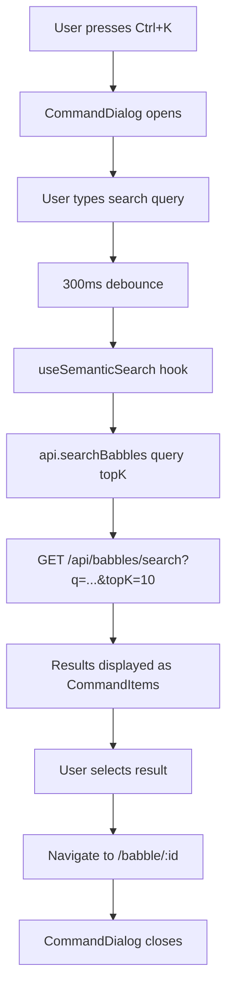

<!-- markdownlint-disable-file -->
# Task Research: Babble Semantic Search Feature

Add a Babble Search feature using Cosmos DB Vector Search with Azure OpenAI embeddings, including a backend search API and a modern live-search frontend component.

## Task Implementation Requests

* Add a `contentVector` embedding property to the Babble domain model
* Deploy an Azure OpenAI embedding model (`text-embedding-3-small`)
* Configure Cosmos DB `babbles` container with vector embedding policy and vector index
* Generate embeddings via `IEmbeddingGenerator<string, Embedding<float>>` (MEAI) when babbles are created/updated
* Create a `GET /api/babbles/search?q=...` semantic search API endpoint
* Build a modern Command Palette (cmdk) live-search component in the React frontend
* Support single-user (search all) vs multi-user (search current user's babbles) modes
* Route queries by complexity: text search for 1-2 word queries, vector search for 3+ words
* Use live debounced search (300ms) with minimum 2-character threshold
* Return 200-char snippets + relevance score from search API (not full text)

## Scope and Success Criteria

* Scope: End-to-end semantic search from embedding generation through Cosmos DB vector storage/query to frontend live-search UI.
* Assumptions:
  * Cosmos DB NoSQL is already used for babble storage (serverless mode, `babbles` container partitioned by `/userId`)
  * Azure OpenAI is available in the deployment via AI Foundry
  * The app has single-user (`_anonymous`) and multi-user (Entra ID) modes already
  * `Microsoft.Azure.Cosmos` 3.58.0 is already in use (vector search requires 3.36.0+)
  * `Microsoft.Extensions.AI` abstraction (`IChatClient`) is already registered — `IEmbeddingGenerator` follows the same pattern
* Success Criteria:
  * Embedding model selected with dimensions, distance function, and index type justified
  * Cosmos DB vector embedding policy and indexing policy fully specified
  * Backend search API endpoint contract defined with query, response, and filtering
  * Embedding generation integrated into create/update flows
  * Frontend Command Palette component designed with keyboard shortcut and API integration
  * Single-user vs multi-user filtering strategy defined using partition key scoping

## Outline

1. Current codebase analysis (domain model, API, infrastructure, frontend)
2. Cosmos DB vector search capabilities and configuration
3. Azure OpenAI embedding model selection
4. Backend changes (domain model, repository, service, API endpoint)
5. Embedding generation pipeline (create/update flow)
6. Infrastructure changes (Aspire AppHost, Bicep, model deployments)
7. Frontend Command Palette live-search component
8. Search UX thresholds and query routing strategy
9. Alternatives analysis and selected approach

## Potential Next Research

* Aspire Cosmos DB integration API for vector embedding policy — whether `AddContainer()` supports `VectorEmbeddingPolicy` in v13.2.4, or if programmatic post-creation setup is needed
* AVM Bicep module `document-db/database-account:0.19.0` support for `vectorEmbeddingPolicy` and `vectorIndexes` in container definitions
* Hybrid search (combining text + vector search with Reciprocal Rank Fusion) for improved accuracy
* Embedding caching strategy to avoid re-generating embeddings for unchanged babble content
* Cosmos DB Full Text Search (`FullTextScore`, `FullTextContains`) GA status for serverless accounts
* AVM Bicep module support for `fullTextPolicy` and `fullTextIndexes` in container definitions
* Embedding caching (in-memory LRU vs Redis) for repeated queries
* Cosmos DB RRF weights parameterization at query time for dynamic routing

## Cosmos DB Serverless Compatibility — Validated

All planned features are confirmed compatible with Cosmos DB NoSQL Serverless capacity mode. Microsoft explicitly markets Cosmos DB NoSQL as "the world's first serverless NoSQL vector database." The only capacity mode excluded from vector search is Shared Throughput databases (provisioned throughput with shared RU/s) — Serverless is NOT affected.

| Requirement | Supported on Serverless? | Notes |
|---|---|---|
| Vector search (`quantizedFlat`, 1536 dims, Float32, Cosine) | YES | Max 4,096 dims for `quantizedFlat` |
| `VectorDistance()` queries | YES | All distance functions supported |
| Full Text Search (`FullTextScore`, `FullTextContains`) | YES | Requires full-text policy + index |
| Hybrid search (`ORDER BY RANK RRF(...)`) | YES | Combines vector + full-text with weighted RRF |
| `EnableServerless` + `EnableNoSQLVectorSearch` coexistence | YES | Capabilities are independent |

**Note:** `quantizedFlat` requires at least 1,000 vectors for accurate quantization — uses full-scan fallback below that threshold (higher RU cost for small datasets). This is acceptable for initial launch.

Source: [Vector search in Azure Cosmos DB for NoSQL](https://learn.microsoft.com/azure/cosmos-db/vector-search), [Azure Cosmos DB serverless](https://learn.microsoft.com/azure/cosmos-db/serverless), subagent research at .copilot-tracking/research/subagents/2026-04-26/cosmos-serverless-vector-support-research.md

## Research Executed

### File Analysis

* prompt-babbler-service/src/Domain/Models/Babble.cs (lines 1–31) — Sealed record with 8 properties. No vector/embedding fields. Uses `[JsonPropertyName]` attributes.
* prompt-babbler-service/src/Domain/Interfaces/IBabbleRepository.cs — `GetByUserAsync` with `search` param does title-only substring matching. No vector search method.
* prompt-babbler-service/src/Domain/Interfaces/IBabbleService.cs — Mirrors IBabbleRepository. Thin pass-through pattern.
* prompt-babbler-service/src/Infrastructure/Services/CosmosBabbleRepository.cs (165 lines) — Database: `prompt-babbler`, Container: `babbles`, Partition key: `/userId`. Search query: `CONTAINS(LOWER(c.title), @search)`. Uses parameterized queries.
* prompt-babbler-service/src/Infrastructure/Services/BabbleService.cs (75 lines) — Thin service wrapping repository. Cascade delete for generated prompts.
* prompt-babbler-service/src/Infrastructure/DependencyInjection.cs (72 lines) — All Cosmos repos registered as Singleton. No embedding service registration.
* prompt-babbler-service/src/Infrastructure/Services/AzureOpenAiPromptGenerationService.cs (56 lines) — Uses `IChatClient` from MEAI. Pattern to follow for `IEmbeddingGenerator`.
* prompt-babbler-service/src/Api/Controllers/BabbleController.cs (411 lines) — REST controller at `/api/babbles`. CRUD + prompt generation. User ID via `User.GetUserIdOrAnonymous()`. No dedicated search endpoint.
* prompt-babbler-service/src/Api/Program.cs (290 lines) — `AzureOpenAIClient` singleton already registered. `IChatClient` registered from chat deployment. Embedding client can follow identical pattern.
* prompt-babbler-service/src/Api/Models/Requests/CreateBabbleRequest.cs — Title (1–200 chars), Text (1–50000 chars), Tags (max 20), IsPinned.
* prompt-babbler-service/src/Api/Models/Responses/BabbleResponse.cs — Id, Title, Text, Tags, CreatedAt, UpdatedAt, IsPinned. No embedding exposed.
* prompt-babbler-service/src/Orchestration/AppHost/AppHost.cs (73 lines) — AI Foundry with single `chat` model deployment (gpt-5.3-chat). Cosmos DB with 4 containers (default indexing). No embedding model.
* prompt-babbler-service/Directory.Packages.props — `Microsoft.Azure.Cosmos` 3.58.0, `Azure.AI.OpenAI` 2.1.0, `Microsoft.Extensions.AI.OpenAI` 10.5.0.
* infra/model-deployments.json — Single model: gpt-5.3-chat, GlobalStandard SKU, capacity 50.
* infra/main.bicep (lines 365–460) — AVM module `document-db/database-account:0.19.0`. Serverless. No vector indexing policy.
* prompt-babbler-app/src/components/babbles/BabbleListSection.tsx — Inline search input with 300ms debounce. Calls `api.getBabbles({ search })`. Title-only filtering.
* prompt-babbler-app/src/services/api-client.ts — Central `fetchJson` helper. All API calls typed. No semantic search function.
* prompt-babbler-app/src/hooks/useBabbles.ts — Core data hook with search, sort, pagination state. Manual useState/useCallback/useEffect pattern.
* prompt-babbler-app/src/components/layout/Header.tsx — Fixed header with nav + UserMenu. Open slot between nav and ml-auto UserMenu for search trigger.
* prompt-babbler-app/components.json — shadcn/ui new-york style, neutral base color.
* prompt-babbler-app/package.json — React 19, Tailwind CSS 4, shadcn 4.0, lucide-react, sonner, tw-animate-css.

### Code Search Results

* `CONTAINS(LOWER(c.title), @search)` — the only text search pattern in the codebase
* `AzureOpenAIClient` — registered as singleton in Program.cs, used for IChatClient
* `IChatClient` — used by AzureOpenAiPromptGenerationService for prompt generation
* `IEmbeddingGenerator` — not present in codebase (to be added)
* `VectorDistance` — not present in codebase (to be added)
* `GetUserIdOrAnonymous()` — ClaimsPrincipalExtensions method returning `_anonymous` or Entra object ID

### External Research

* Microsoft Learn: [Index and query vectors in Azure Cosmos DB for NoSQL in .NET](https://learn.microsoft.com/azure/cosmos-db/how-to-dotnet-vector-index-query)
  * Full .NET SDK examples for vector embedding policy, vector index creation, and VectorDistance queries
  * Requires SDK 3.45.0+ (project uses 3.58.0)
  * Vector embedding policy must be set at container creation (immutable after)
  * Vector paths must be in `excludedPaths` for optimal insert performance
* Microsoft Learn: [Vector search in Azure Cosmos DB for NoSQL](https://learn.microsoft.com/azure/cosmos-db/vector-search)
  * Three index types: `flat` (max 505 dims), `quantizedFlat` (max 4096 dims), `diskANN` (max 4096 dims)
  * `quantizedFlat` and `diskANN` require 1,000+ vectors for accurate quantization
  * Serverless accounts support vector search (no shared throughput limitation)
  * Vector policies are immutable after container creation
* Microsoft Learn: [Microsoft.Extensions.AI IEmbeddingGenerator](https://learn.microsoft.com/dotnet/ai/iembeddinggenerator)
  * `IEmbeddingGenerator<string, Embedding<float>>` — standard MEAI abstraction
  * `GenerateAsync(IEnumerable<string>)` returns `GeneratedEmbeddings<Embedding<float>>`
  * Azure OpenAI: `openAiClient.GetEmbeddingClient("deployment").AsIEmbeddingGenerator()`
* Microsoft Foundry Model Catalog: `text-embedding-3-small`
  * OpenAI model, standard-paygo deployment, 1536 default dimensions (configurable down to 256)
  * 8191 token context window
  * Supports `GlobalStandard` and `Standard` SKUs
  * Source: Microsoft Foundry MCP model catalog list
* Microsoft Learn: [Cosmos DB vector search quickstart (.NET)](https://learn.microsoft.com/azure/cosmos-db/quickstart-vector-store-dotnet)
  * VectorSearchService sample with embedding generation + Cosmos query
  * Uses `AzureOpenAIClient.GetEmbeddingClient().GenerateEmbeddingAsync()` for query embedding
  * VectorDistance query: `SELECT TOP @topK c, VectorDistance(c.field, @embedding) AS Score FROM c ORDER BY VectorDistance(c.field, @embedding)`

### Project Conventions

* Standards referenced: Clean Architecture (Domain → Infrastructure → Api), immutable records, MEAI abstractions, singleton Cosmos repositories
* Instructions followed: `Directory.Build.props` (net10.0, nullable enabled, TreatWarningsAsErrors), `Directory.Packages.props` (centralized package management)
* Testing: MSTest v4 + FluentAssertions + NSubstitute, unit tests in `tests/unit/`, integration in `tests/integration/`
* Frontend: React 19 + shadcn/ui + Tailwind CSS 4, manual hooks (no React Query), continuation-token pagination

## Key Discoveries

### Project Structure

The project follows Clean Architecture with strict dependency direction (Domain → Infrastructure → Api). The Babble entity is a sealed C# record partitioned by `/userId` in Cosmos DB serverless. All Cosmos DB interactions go through singleton repositories using the `Microsoft.Azure.Cosmos` SDK directly (not EF Core). AI services use `Microsoft.Extensions.AI` abstractions (`IChatClient`), and `AzureOpenAIClient` is already registered as a singleton. The frontend is React 19 with shadcn/ui components, manual data-fetching hooks, and continuation-token pagination.

### Implementation Patterns

**Backend embedding generation pattern** (follows existing `IChatClient` registration):

```csharp
// In Program.cs — alongside existing IChatClient registration
var embeddingClient = openAiClient.GetEmbeddingClient("embedding")
    .AsIEmbeddingGenerator();
builder.Services.AddSingleton<IEmbeddingGenerator<string, Embedding<float>>>(embeddingClient);
```

**Cosmos DB vector search query pattern:**

```csharp
var queryText = @"
    SELECT TOP @topK c.id, c.userId, c.title, c.text, c.tags, c.createdAt, c.updatedAt, c.isPinned,
           VectorDistance(c.contentVector, @embedding) AS SimilarityScore
    FROM c
    WHERE c.userId = @userId
    ORDER BY VectorDistance(c.contentVector, @embedding)";

var queryDef = new QueryDefinition(queryText)
    .WithParameter("@topK", topK)
    .WithParameter("@embedding", queryEmbedding)
    .WithParameter("@userId", userId);
```

**Embedding generation on create/update:**

```csharp
// Generate embedding from concatenated title + text
var textToEmbed = $"{babble.Title}\n{babble.Text}";
var embeddings = await embeddingGenerator.GenerateAsync([textToEmbed], cancellationToken: ct);
var vector = embeddings[0].Vector.ToArray();

// Set on babble record
var babbleWithVector = babble with { ContentVector = vector };
```

### Complete Examples

**Cosmos DB Container Properties with Vector Policy (C# SDK):**

```csharp
var containerProperties = new ContainerProperties("babbles", "/userId")
{
    VectorEmbeddingPolicy = new VectorEmbeddingPolicy(new Collection<Embedding>
    {
        new()
        {
            Path = "/contentVector",
            DataType = VectorDataType.Float32,
            DistanceFunction = DistanceFunction.Cosine,
            Dimensions = 1536,
        }
    }),
    IndexingPolicy = new IndexingPolicy
    {
        VectorIndexes =
        {
            new VectorIndexPath
            {
                Path = "/contentVector",
                Type = VectorIndexType.QuantizedFlat,
            }
        }
    }
};
containerProperties.IndexingPolicy.IncludedPaths.Add(new IncludedPath { Path = "/*" });
containerProperties.IndexingPolicy.ExcludedPaths.Add(new ExcludedPath { Path = "/contentVector/*" });
containerProperties.IndexingPolicy.ExcludedPaths.Add(new ExcludedPath { Path = "/_etag/?" });
```

**Frontend Command Palette pattern (React + shadcn/ui cmdk):**

```typescript
// SearchCommand.tsx
import { CommandDialog, CommandInput, CommandList, CommandItem, CommandEmpty } from "@/components/ui/command";

export function SearchCommand() {
  const [open, setOpen] = useState(false);
  const [query, setQuery] = useState("");
  const { results, loading } = useSemanticSearch(query);

  useEffect(() => {
    const down = (e: KeyboardEvent) => {
      if (e.key === "k" && (e.metaKey || e.ctrlKey)) {
        e.preventDefault();
        setOpen((open) => !open);
      }
    };
    document.addEventListener("keydown", down);
    return () => document.removeEventListener("keydown", down);
  }, []);

  return (
    <CommandDialog open={open} onOpenChange={setOpen}>
      <CommandInput placeholder="Search babbles..." value={query} onValueChange={setQuery} />
      <CommandList>
        <CommandEmpty>{loading ? "Searching..." : "No results found."}</CommandEmpty>
        {results.map((babble) => (
          <CommandItem key={babble.id} onSelect={() => navigate(`/babble/${babble.id}`)}>
            <span>{babble.title}</span>
            <span className="text-muted-foreground text-sm truncate">{babble.text}</span>
          </CommandItem>
        ))}
      </CommandList>
    </CommandDialog>
  );
}
```

### API and Schema Documentation

**New search endpoint contract:**

```
GET /api/babbles/search?q={query}&topK={number}

Query Parameters:
  q      (required) — Search query text (1–200 chars)
  topK   (optional) — Max results to return (default: 10, max: 50)

Response: 200 OK
{
  "items": [
    {
      "id": "string",
      "title": "string",
      "text": "string",
      "tags": ["string"],
      "createdAt": "2026-04-26T00:00:00Z",
      "updatedAt": "2026-04-26T00:00:00Z",
      "isPinned": false,
      "similarityScore": 0.95
    }
  ]
}

Behavior:
  - Single-user mode: searches all babbles (userId = "_anonymous")
  - Multi-user mode: searches current user's babbles only (userId = Entra object ID)
  - Generates embedding for query text via IEmbeddingGenerator
  - Queries Cosmos DB using VectorDistance with partition key scoping
  - Returns results ordered by similarity (highest first)
```

**Updated Babble domain model:**

```csharp
public sealed record Babble
{
    [JsonPropertyName("id")]            public required string Id { get; init; }
    [JsonPropertyName("userId")]        public required string UserId { get; init; }
    [JsonPropertyName("title")]         public required string Title { get; init; }
    [JsonPropertyName("text")]          public required string Text { get; init; }
    [JsonPropertyName("createdAt")]     public required DateTimeOffset CreatedAt { get; init; }
    [JsonPropertyName("tags")]          public IReadOnlyList<string>? Tags { get; init; }
    [JsonPropertyName("updatedAt")]     public required DateTimeOffset UpdatedAt { get; init; }
    [JsonPropertyName("isPinned")]      public bool IsPinned { get; init; }
    [JsonPropertyName("contentVector")] public ReadOnlyMemory<float>? ContentVector { get; init; }
}
```

**New search response model:**

```csharp
public sealed record BabbleSearchResult
{
    public required BabbleResponse Babble { get; init; }
    public required double SimilarityScore { get; init; }
}
```

### Configuration Examples

**model-deployments.json (add embedding model):**

```json
[
  {
    "model": { "format": "OpenAI", "name": "gpt-5.3-chat", "version": "2026-03-03" },
    "name": "chat",
    "sku": { "name": "GlobalStandard", "capacity": 50 },
    "raiPolicyName": "PromptBabblerContentPolicy"
  },
  {
    "model": { "format": "OpenAI", "name": "text-embedding-3-small", "version": "1" },
    "name": "embedding",
    "sku": { "name": "GlobalStandard", "capacity": 50 }
  }
]
```

**Aspire AppHost embedding deployment:**

```csharp
var embeddingDeployment = foundryProject.AddModelDeployment(
    "embedding",
    builder.Configuration["MicrosoftFoundry:embeddingModelName"] ?? "text-embedding-3-small",
    builder.Configuration["MicrosoftFoundry:embeddingModelVersion"] ?? "1",
    "OpenAI")
    .WithProperties(deployment =>
    {
        deployment.SkuName = "GlobalStandard";
        deployment.SkuCapacity = 50;
    });
```

**Program.cs embedding registration:**

```csharp
// After existing IChatClient registration
var embeddingDeploymentName = builder.Configuration["MicrosoftFoundry:embeddingDeploymentName"] ?? "embedding";
var embeddingClient = openAiClient.GetEmbeddingClient(embeddingDeploymentName)
    .AsIEmbeddingGenerator();
builder.Services.AddSingleton<IEmbeddingGenerator<string, Embedding<float>>>(embeddingClient);
```

## Technical Scenarios

### Scenario 1: Embedding Model Selection

**Description:** Choose between `text-embedding-3-small` and `text-embedding-3-large` for generating babble embeddings.

**Requirements:**

* Semantic search over babble title + text content
* Storage within Cosmos DB documents (serverless, pay-per-request)
* Low latency for real-time embedding generation during create/update
* Cost-effective for a personal/small-team productivity tool

**Preferred Approach: `text-embedding-3-small` with 1536 dimensions**

| Criterion | text-embedding-3-small | text-embedding-3-large |
|---|---|---|
| Dimensions (default) | 1536 | 3072 |
| Max dimensions | 1536 | 3072 |
| Token context | 8191 | 8191 |
| Cost (per 1M tokens) | ~$0.02 | ~$0.13 |
| Quality (MTEB) | Good | Higher |
| Storage per document | ~6KB | ~12KB |
| Cosmos DB index type | quantizedFlat (< 4096) | quantizedFlat (< 4096) |

**Rationale:** `text-embedding-3-small` provides excellent quality for short-to-medium text (babble titles + content), costs 6.5x less, requires half the storage, and stays well within Cosmos DB's 4096-dimension limit for `quantizedFlat` indexing. For a personal productivity tool, the marginal quality improvement of `text-embedding-3-large` does not justify the cost increase.

#### Considered Alternatives

**text-embedding-3-large (3072 dims):** Higher quality on MTEB benchmarks, but 6.5x more expensive and double the storage. Overkill for searching personal babble notes. Rejected due to cost/benefit ratio.

**text-embedding-3-small with reduced dimensions (512):** Smaller storage footprint, but would require custom dimension reduction configuration. The default 1536 fits comfortably within Cosmos DB limits and provides better quality. Rejected — premature optimization.

**text-embedding-ada-002:** Legacy model, being superseded by text-embedding-3 series. Lower quality at the same cost. Rejected — use current-generation model.

---

### Scenario 2: Cosmos DB Vector Index Type

**Description:** Choose the appropriate vector index type for the `babbles` container.

**Requirements:**

* Personal productivity app — typical dataset: 100s to low 1000s of babbles per user
* Queries always scoped to a single partition (userId)
* Serverless Cosmos DB (pay-per-request RUs)
* High accuracy preferred over approximate results

**Preferred Approach: `quantizedFlat` index**

| Criterion | flat | quantizedFlat | diskANN |
|---|---|---|---|
| Max dimensions | 505 | 4096 | 4096 |
| Accuracy | 100% (brute-force) | Near 100% | Approximate |
| Best for vectors scoped to | Any | < 50,000 | > 50,000 |
| Min vectors required | 0 | 1,000 (falls back to scan) | 1,000 |
| RU cost | Higher | Lower | Lowest |

**Rationale:** `quantizedFlat` supports 1536 dimensions (required for `text-embedding-3-small`), provides near-100% accuracy for brute-force search, and is recommended for datasets under 50,000 vectors per partition. Since queries are always scoped to a single user's partition (typically 100s–1000s of babbles), this is ideal. For fewer than 1,000 vectors, Cosmos DB falls back to a full scan, which is acceptable for this scale.

**Note on container recreation:** Vector policies are immutable after container creation. Since the app has not been deployed to production yet, the `babbles` container can simply be created with the new vector embedding policy and vector index from the start — no data migration is needed.

#### Considered Alternatives

**`flat` index:** 100% accuracy, but limited to 505 dimensions — incompatible with 1536-dimension embeddings. Rejected.

**`diskANN` index:** Best for 50,000+ vectors, but adds complexity for this scale. Also requires 1,000+ vectors before quantization is accurate. Rejected for this use case — `quantizedFlat` is simpler and sufficient.

---

### Scenario 3: Embedding Generation Pipeline

**Description:** How and when to generate embeddings for babble content.

**Requirements:**

* Embeddings must be generated on babble create and update
* Must embed combined `title + text` for semantic search on both fields
* Latency impact on create/update should be acceptable

**Preferred Approach: Synchronous embedding generation in the service layer**

```text
User creates/updates babble
    → BabbleController validates input
    → BabbleService.CreateAsync / UpdateAsync
        → IEmbeddingGenerator.GenerateAsync([$"{title}\n{text}"])
        → Set ContentVector on Babble record
        → IBabbleRepository.CreateAsync / UpdateAsync (writes to Cosmos DB)
```

**Rationale:** Synchronous generation is simpler, avoids eventual consistency issues, and keeps the embedding always in sync with the content. For a single embedding call, Azure OpenAI typically responds in 50–200ms, which is acceptable for a create/update operation. The `IBabbleService` is the right layer for this since it already coordinates between services (e.g., cascade delete). Since the app has not been deployed to production yet, there are no existing babbles to backfill — all new babbles will have embeddings generated at creation time.

#### Considered Alternatives

**Asynchronous (background job/queue):** Decouples embedding generation from the request. Pros: lower latency on create/update. Cons: eventual consistency, more complex infrastructure (need a queue + worker), search may return stale results. Rejected — the synchronous approach is simpler and the latency is acceptable.

**Change feed trigger:** Cosmos DB change feed fires on create/update, a separate processor generates embeddings. Pros: fully decoupled. Cons: requires additional infrastructure (Azure Functions or change feed processor), adds latency before search availability, risk of infinite loop if embedding update triggers change feed. Rejected — too complex for this scenario.

---

### Scenario 4: Search API Design

**Description:** Design the backend API endpoint for semantic search.

**Requirements:**

* Accept a text query and return semantically similar babbles
* Respect single-user vs multi-user mode
* Return relevance scores
* Fast enough for live search (< 500ms)

**Preferred Approach: New `GET /api/babbles/search` endpoint**

```text
File tree changes:
  prompt-babbler-service/
  └── src/
      ├── Domain/
      │   ├── Interfaces/
      │   │   ├── IBabbleRepository.cs        (add SearchByVectorAsync method)
      │   │   ├── IBabbleService.cs            (add SearchAsync method)
      │   │   └── IEmbeddingService.cs         (NEW — embedding generation interface)
      │   └── Models/
      │       ├── Babble.cs                    (add ContentVector property)
      │       └── BabbleSearchResult.cs        (NEW — search result with score)
      ├── Infrastructure/
      │   ├── Services/
      │   │   ├── CosmosBabbleRepository.cs    (add SearchByVectorAsync implementation)
      │   │   ├── BabbleService.cs             (add SearchAsync with embedding generation)
      │   │   └── EmbeddingService.cs          (NEW — wraps IEmbeddingGenerator)
      │   └── DependencyInjection.cs           (register IEmbeddingService)
      └── Api/
          ├── Controllers/
          │   └── BabbleController.cs          (add Search action)
          └── Models/
              └── Responses/
                  └── BabbleSearchResponse.cs  (NEW — search response with score)
```

**Implementation Details:**

The search flow:

1. `BabbleController.Search(q, topK)` — validates query, extracts userId
2. `IBabbleService.SearchAsync(userId, query, topK)` — generates embedding, calls repository
3. `IEmbeddingService.GenerateEmbeddingAsync(query)` — wraps `IEmbeddingGenerator`
4. `IBabbleRepository.SearchByVectorAsync(userId, embedding, topK)` — Cosmos DB VectorDistance query

```csharp
// New repository method
Task<IReadOnlyList<(Babble Babble, double SimilarityScore)>> SearchByVectorAsync(
    string userId,
    ReadOnlyMemory<float> embedding,
    int topK = 10,
    CancellationToken cancellationToken = default);
```

```csharp
// Cosmos DB query in repository
var queryText = @"
    SELECT TOP @topK c.id, c.userId, c.title, c.text, c.tags, c.createdAt, c.updatedAt, c.isPinned,
           VectorDistance(c.contentVector, @embedding) AS similarityScore
    FROM c
    WHERE c.userId = @userId
    ORDER BY VectorDistance(c.contentVector, @embedding)";
```

**Note:** The response model (`BabbleSearchResponse`) should NOT include the embedding vector — only the babble data plus similarity score.

#### Considered Alternatives

**Extend existing `GET /api/babbles` with `semanticSearch` parameter:** Would keep a single endpoint. Rejected because: (1) the response shape differs (includes similarity score), (2) pagination model differs (top-K vs continuation token), (3) mixing text and vector search in one endpoint adds complexity.

**`POST /api/babbles/search` with body:** More REST-ful for complex queries. Rejected because: (1) a simple GET with query params is sufficient for a single search string + topK, (2) GET is cacheable, (3) the frontend integration is simpler.

---

### Scenario 5: Frontend Search UI

**Description:** Design the frontend search component for semantic babble search.

**Requirements:**

* Modern, keyboard-first search experience
* Accessible from any page (not just home page)
* Show relevant babble results with titles and excerpts
* Navigate to babble detail on selection
* Non-disruptive to existing page layout

**Preferred Approach: Command Palette (cmdk) using shadcn/ui Command component**

```text
File tree changes:
  prompt-babbler-app/
  └── src/
      ├── components/
      │   ├── search/
      │   │   └── SearchCommand.tsx            (NEW — Command Palette dialog)
      │   ├── layout/
      │   │   └── Header.tsx                   (MODIFY — add search trigger button)
      │   └── ui/
      │       └── command.tsx                  (NEW — shadcn/ui Command component)
      ├── hooks/
      │   └── useSemanticSearch.ts             (NEW — search API hook with debounce)
      ├── services/
      │   └── api-client.ts                    (MODIFY — add searchBabbles function)
      └── types/
          └── index.ts                         (MODIFY — add BabbleSearchResult type)
```



**Implementation Details:**

1. Install shadcn/ui Command: `npx shadcn@latest add command` (adds `cmdk` dependency)
2. `SearchCommand.tsx` — wraps `CommandDialog` with search input, result list, keyboard shortcut
3. `useSemanticSearch.ts` — custom hook: debounced query → `api.searchBabbles()` → results
4. Header trigger button: search icon + `Ctrl+K` badge, positioned between nav and UserMenu
5. Result items show: title (bold), truncated text excerpt, tags as badges, relative time

```typescript
// New API function in api-client.ts
export interface BabbleSearchResult {
  id: string;
  title: string;
  text: string;
  tags?: string[];
  isPinned: boolean;
  createdAt: string;
  updatedAt: string;
  similarityScore: number;
}

export async function searchBabbles(
  query: string,
  topK: number = 10,
  accessToken?: string
): Promise<{ items: BabbleSearchResult[] }> {
  return fetchJson(`/api/babbles/search?q=${encodeURIComponent(query)}&topK=${topK}`, {
    headers: accessToken ? { Authorization: `Bearer ${accessToken}` } : {},
  });
}
```

#### Considered Alternatives

**Inline Search with Dropdown (Popover):** Always-visible input in header with floating results. Rejected because: (1) takes permanent header space, (2) requires Popover component (not installed), (3) less elegant keyboard-first UX, (4) z-index/positioning complexity.

**Full-page Search (`/search` route):** Dedicated search results page. Rejected because: (1) slower UX (full navigation), (2) disrupts current workflow, (3) overkill for a "find a babble" use case.

**Enhance existing BabbleListSection search:** Add semantic search to the existing inline search. Rejected because: (1) only accessible on home page, (2) mixes pagination models (continuation token vs top-K), (3) no relevance score display.

---

### Scenario 6: Infrastructure and Deployment Changes

**Description:** Changes needed to Aspire AppHost, Bicep infrastructure, and model deployments.

**Requirements:**

* Deploy `text-embedding-3-small` model alongside existing chat model
* Configure Cosmos DB container with vector embedding policy and index
* Enable vector search feature on Cosmos DB account

**Preferred Approach: Add embedding deployment + create babbles container with vector policy**

```text
File tree changes:
  infra/
  ├── main.bicep                               (MODIFY — add EnableNoSQLVectorSearch capability, vector policy on babbles container)
  └── model-deployments.json                   (MODIFY — add embedding model deployment)
  prompt-babbler-service/
  └── src/
      └── Orchestration/
          └── AppHost/
              └── AppHost.cs                   (MODIFY — add embedding model deployment + reference)
```

**Bicep changes for Cosmos DB:**

```bicep
// Add to Cosmos DB account capabilities
capabilities: [
  { name: 'EnableServerless' }
  { name: 'EnableNoSQLVectorSearch' }
]

// babbles container definition needs:
// vectorEmbeddingPolicy and indexingPolicy with vectorIndexes
// Note: This may require checking if the AVM module supports these properties
```

**Aspire AppHost changes:**

```csharp
// Add embedding model deployment
var embeddingDeployment = foundryProject.AddModelDeployment(
    "embedding",
    builder.Configuration["MicrosoftFoundry:embeddingModelName"] ?? "text-embedding-3-small",
    builder.Configuration["MicrosoftFoundry:embeddingModelVersion"] ?? "1",
    "OpenAI")
    .WithProperties(deployment =>
    {
        deployment.SkuName = "GlobalStandard";
        deployment.SkuCapacity = 50;
    });

// Add reference to API service
apiService.WithReference(embeddingDeployment)
    .WaitFor(embeddingDeployment);
```

**No migration needed:** Since the app has not been deployed to production yet, there are no existing babbles or containers to migrate. The `babbles` container will be created fresh with the vector embedding policy and vector index from the start, both in the Aspire emulator and in the first production deployment.

#### Considered Alternatives

**Skip Bicep/infra changes, configure programmatically:** Create the container with vector policy via C# code at startup. Rejected because: (1) Aspire already manages container creation, (2) Bicep should be the source of truth for infrastructure, (3) programmatic creation conflicts with Aspire's declarative model.

**Use a separate container for vectors:** Store embeddings in a `babble-vectors` container linked by ID. Rejected because: (1) requires cross-container joins or multiple queries, (2) increases RU cost, (3) Cosmos DB vector search is designed for co-located vectors.

### Scenario 7: Query Routing — Vector vs Text Search

**Description:** Determine when to route a search query to vector (semantic) search vs simple text/substring search to optimize cost and latency.

**Requirements:**

* Minimize unnecessary embedding API calls (latency is 50-200ms per call)
* Maintain high-quality search results regardless of query length
* Keep routing logic server-side so it can be tuned without app updates
* Support the tiered live search pattern (client-side → text → vector)

**Preferred Approach: Route by query complexity (word count / character count)**

| Query Complexity | Search Strategy | Rationale |
|---|---|---|
| Empty or < 2 characters | No API search (show default list) | Too short to be meaningful |
| 1-2 words AND < 15 chars | Text search only (`CONTAINS`) | Exact-match intent, zero embedding cost, instant |
| 3+ words OR 15+ chars | Vector search | Semantic intent likely, embedding adds value |

The backend `GET /api/babbles/search?q=...` endpoint accepts the raw query and decides routing internally. The frontend sends the same `?q=` parameter regardless.

**Rationale:** Short queries (1-2 words) have low semantic density — embeddings struggle to disambiguate intent. Research from Azure AI Search benchmarks and Algolia's hybrid search documentation consistently shows keyword search outperforms or matches vector search for queries under 3 words. For a command palette, most queries are 1-2 words (e.g. "standup", "TODO") where exact title matching is the expected behavior.

**Cost implication:** This routing saves ~60-80% of embedding API calls (most command palette queries are 1-2 words) with negligible impact on result quality for short queries. Embedding cost is negligible (~$0.01/month at 1K queries/day), but the latency saving (50-200ms per avoided call) is significant for live search UX.

**Discovery — Cosmos DB Native Hybrid Search:** Cosmos DB NoSQL supports `ORDER BY RANK RRF(VectorDistance(...), FullTextScore(...))` combining vector and full-text BM25 scoring with weighted Reciprocal Rank Fusion. This could replace the manual routing for a single unified query, but requires full-text indexing policies not yet configured. This is listed as potential next research.

#### Considered Alternatives

**Always use vector search for all queries:** Simpler implementation but wastes 60-80% of embedding calls on short queries where text search performs equally well. Adds 50-200ms latency to every query. Rejected for cost and latency reasons.

**Live text search + vector on Enter:** Text search fires on every keystroke (debounced); vector search only triggers when user presses Enter. Provides instant feedback via text while reserving vector for deliberate queries. Rejected because it breaks the standard command palette live search pattern — users expect all results to update live without pressing Enter.

**Cosmos DB native hybrid search for all queries:** Use `FullTextScore` + `VectorDistance` with RRF for every query. Requires full-text indexing policy and generates an embedding call for every query. More accurate for borderline cases but higher cost and requires infrastructure changes not yet scoped. Deferred as potential next research.

### Scenario 8: Minimum Input Length Before Search

**Description:** Determine the minimum number of characters the user must type before the frontend sends an API search request.

**Requirements:**

* Avoid noisy, meaningless results (e.g., searching for "a")
* Minimize wasted Cosmos DB RU costs from overly broad queries
* Maintain responsive UX — users should see results quickly after typing a meaningful query

**Preferred Approach: Minimum 2 characters before API search**

Below 2 characters, show a default state (recent or pinned babbles) without calling the API. At 2+ characters, fire the debounced search.

| Input State | Behavior |
|---|---|
| 0-1 characters | Show default state (recent/pinned babbles). No API call. |
| 2+ characters | Fire debounced text search API call |
| 3+ words OR 15+ chars | Fire debounced vector search API call (per Scenario 7) |

**Rationale:** Industry research: VS Code (0 chars, but client-side pre-loaded), GitHub (1 char), Slack (1 char), Algolia (0-1 char). For server-side search with Cosmos DB RU cost, 2 characters is the practical minimum — 1-character queries match too many documents and waste 2-5 RUs per call on meaningless results. Nielsen Norman Group research confirms that search suggestions should always return good results — single-character queries cannot guarantee this.

**Cost implication:** Saves ~30-40% of API calls compared to firing at 1 character (many queries start with a single character and quickly add more).

#### Considered Alternatives

**1 character minimum:** More responsive, but produces noisy results for server-side search. Appropriate for client-side filtering of pre-loaded data (e.g., VS Code commands) but not for Cosmos DB queries. Rejected for cost and noise reasons.

**3 character minimum:** More conservative, fewer API calls, but feels sluggish. Users typing 2-character abbreviations ("AI", "PR", "QA") would see no results. Rejected for UX reasons.

### Scenario 9: Debounce Delay Between Keystrokes

**Description:** Determine the debounce delay between keystrokes before firing a search API call.

**Requirements:**

* Balance perceived responsiveness with API call cost
* Maintain consistency with existing codebase patterns
* Account for backend latency (embedding call + Cosmos DB query)

**Preferred Approach: 300ms debounce**

Wait 300ms after the last keystroke before sending the API search request.

**Rationale:** The existing `BabbleListSection.tsx` already uses 300ms debounce — maintaining this value ensures consistency across the app. Industry benchmarks: Google ~200-300ms, GitHub ~300ms, Algolia 200-400ms, Slack ~300ms. Jakob Nielsen's research identifies 100ms as "instant", 1000ms as "flow-breaking", and 200-300ms as the sweet spot.

With 300ms debounce + ~150ms backend (text search) or ~300ms backend (vector search), total perceived latency is 450-600ms — within the acceptable range.

A typical search session of 10 keystrokes generates ~3-4 API calls instead of 10. Combined with the 2-character minimum (Scenario 8), most sessions produce 2-3 actual API calls.

#### Considered Alternatives

**200ms debounce:** Faster perceived response but ~30% more API calls. Marginal UX improvement doesn't justify the cost increase. Could be considered if vector search is removed from the live path.

**500ms debounce:** More cost-efficient but users perceive noticeable lag. Feels unresponsive for a live search UX. Rejected.

### Scenario 10: Search Trigger — Live vs Enter-Triggered

**Description:** Determine whether search should update live as the user types (debounced) or only trigger when the user presses Enter.

**Requirements:**

* Follow the cmdk Command Palette UX convention
* Minimize unnecessary API calls while maintaining responsiveness
* Support the tiered routing strategy (text → vector)

**Preferred Approach: Live search (debounced) with tiered routing**

Search results update live as the user types, using the debounce (300ms) and minimum character (2) thresholds from Scenarios 8-9. The tiered routing from Scenario 7 automatically selects text vs vector search based on query complexity.

**Three-phase search flow:**

1. **Phase 1 — Instant (0ms):** cmdk's built-in client-side filtering on pre-loaded items (recent/pinned babbles). Free and instant.
2. **Phase 2 — Debounced (300ms, 2+ chars):** Text search API call via `CONTAINS(LOWER(c.title), @search)`. Fast (~5-50ms), cheap (~2-5 RUs). Gives immediate narrowing feedback.
3. **Phase 3 — Debounced (300ms, 3+ words):** Vector search API call for semantic results. More expensive but provides semantic "magic" only when the query has enough complexity to benefit.

Use cmdk with `shouldFilter={false}` for server-managed results and `Command.Loading` for async feedback.

**Rationale:** cmdk is designed as a live-filter component with no built-in Enter-to-search. All major command palettes (VS Code, GitHub Ctrl+K, Linear, Vercel) use live search. The tiered approach means ~80% of search interactions only trigger text search, keeping costs low while maintaining the responsive UX users expect.

#### Considered Alternatives

**Enter-triggered only:** Fewer API calls and simpler implementation, but breaks the command palette convention. Users must commit to a query before seeing any results, removing the discovery and narrowing experience. Rejected for UX reasons.

**Live text + Enter for vector:** Text search fires live; vector search triggers only on Enter press. Provides instant text feedback while reserving vector for deliberate queries. Rejected because it creates a confusing dual-trigger UX — users wouldn't know when to press Enter vs just type. The tiered routing approach achieves the same cost optimization transparently.

### Scenario 11: Search API Response Format — Snippets vs Full Text

**Description:** Determine whether the search API returns full babble text or truncated snippets in search results.

**Requirements:**

* Minimize response payload size for fast rendering in the command palette
* Provide enough context for users to identify the right result
* Include relevance scoring for result ordering
* Support client-side highlighting of matched terms

**Preferred Approach: Return 200-character snippets + title + relevance score**

The search API returns a lightweight result object:

```json
{
  "results": [
    {
      "id": "guid",
      "title": "Standup Notes",
      "snippet": "Discussed the new search feature implementation with the team...",
      "tags": ["meeting", "standup"],
      "createdAt": "2026-04-25T10:00:00Z",
      "isPinned": false,
      "score": 0.87,
      "searchType": "vector"
    }
  ],
  "totalCount": 42,
  "searchType": "vector|text"
}
```

Full babble text is loaded only when the user selects a result from the command palette.

**Cosmos DB query projection:**

```sql
SELECT c.id, c.title, c.userId, c.createdAt, c.isPinned, c.tags,
       SUBSTRING(c.text, 0, 200) AS snippet,
       VectorDistance(c.contentVector, @embedding) AS score
FROM c
WHERE c.userId = @userId
ORDER BY VectorDistance(c.contentVector, @embedding)
```

For text search, compute a context-aware snippet centered on the first match position using `INDEX_OF(LOWER(c.text), @search)` to extract the relevant portion.

**Rationale:** A babble's `text` field can be up to 50K characters. Returning 10 full documents = 500KB+ payload vs ~5KB for snippets (95% bandwidth reduction). All major search products (Azure AI Search, Elasticsearch, Algolia, GitHub) return snippets by default. The 200-character length covers 1-2 sentences — enough for identification in the compact command palette UI.

**Client-side highlighting:** Wrap matched terms in `<mark>` tags in the React component. For text search, highlight the search term. For vector search (semantic match with no direct keyword match), display the snippet without highlighting — the relevance score indicates quality.

**`searchType` indicator:** Included in the response so the frontend can render differently if needed (e.g., show a "semantic" badge on vector results).

#### Considered Alternatives

**300-character snippets:** Slightly more context per result, but the command palette has limited display space. Extra 100 chars adds payload without UX benefit in a compact dropdown. Could be revisited for a full search results page.

**Full text in response:** Simplest implementation (no projection needed) but ~95% more bandwidth. Unacceptable for a live search UX where results refresh on every debounced keystroke. Rejected.

**Server-side highlighting (HTML snippets):** Generate `<mark>`-wrapped HTML server-side. Adds complexity to the API and creates an XSS surface if not sanitized. Client-side highlighting with React components is safer and simpler. Rejected.

## Search UX Decisions Summary

| Parameter | Decision | Rationale |
|---|---|---|
| Vector vs text routing | 1-2 words → text, 3+ words → vector | Saves ~60-80% embedding calls; short queries have low semantic density |
| Minimum chars before search | 2 characters | Below 2 is too noisy for server-side search; saves ~30-40% API calls |
| Debounce delay | 300ms | Matches existing codebase pattern (`BabbleListSection.tsx`); industry standard |
| Search trigger | Live (debounced) | Standard cmdk pattern; tiered routing keeps ~80% of queries text-only |
| Response format | 200-char snippets + score | 95% bandwidth reduction; full text loaded on selection |
| Relevance score | Included (`VectorDistance` / match indicator) | Enables result ordering and threshold filtering |
| Client highlighting | `<mark>` tags in React | Safer than server-side HTML; simpler implementation |
