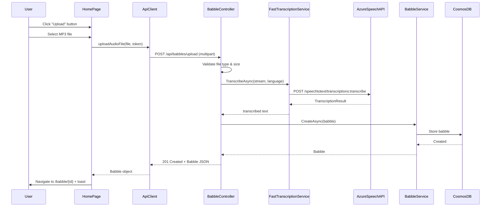

<!-- markdownlint-disable-file -->
# Task Research: MP3 File Upload Batch Transcription

Add support for uploading an MP3 file as a babble that will be transcribed as a batch process instead of a real-time stream. The feature includes an Upload button on the home panel and performs transcription asynchronously using the Azure Fast Transcription API.

## Task Implementation Requests

* Add an Upload button (smaller, outline variant) on the home panel alongside the existing "New Babble" button
* Implement batch transcription of uploaded MP3 files using Azure Fast Transcription API (`Azure.AI.Speech.Transcription`)
* Backend receives file via multipart/form-data, transcribes it in a single API call, and creates a babble
* Navigate to the babble detail page after successful upload/transcription

## Scope and Success Criteria

* Scope: End-to-end MP3 upload flow from frontend UI to backend transcription and babble creation; excludes changes to existing real-time streaming transcription
* Assumptions:
  * Azure Speech-to-Text service is already provisioned (used for real-time streaming)
  * The existing Cognitive Services resource is S0 tier in a supported region
  * Cosmos DB storage for babbles is already in place
  * Authentication/authorization patterns are established
  * Beta package (Azure.AI.Speech.Transcription v1.0.0-beta.2) is acceptable
  * Files up to 500 MB should be supported
* Success Criteria:
  * User can upload an audio file (MP3, WAV, WebM, OGG) via a button on the home panel
  * File is transcribed using Azure Fast Transcription API (single synchronous call)
  * Resulting transcription is stored as a babble with auto-generated title
  * Implementation follows existing project patterns and conventions (sealed classes, DI, etc.)
  * No Azure Blob Storage required — files stream directly to the service

## Outline

1. Current implementation analysis
2. Azure Speech-to-Text transcription options evaluated
3. Selected approach: Azure Fast Transcription API
4. Frontend implementation plan
5. Backend implementation plan
6. Infrastructure/DI changes
7. File tree of changes

## Potential Next Research

* Verify the project's Cognitive Services resource is in a supported region for Fast Transcription
* Investigate upload progress reporting (chunked upload or XHR progress events)
* Research drag-and-drop file upload as a future enhancement
* Determine if Enhanced Mode (LLM-powered transcription) should be enabled by default
* Pricing validation: confirm Fast Transcription API cost per audio hour

## Research Executed

### File Analysis

* `prompt-babbler-service/src/Infrastructure/Services/AzureSpeechTranscriptionService.cs`
  * Current streaming implementation uses `Microsoft.CognitiveServices.Speech` native SDK
  * Implements `IRealtimeTranscriptionService` with continuous recognition over PushStream
  * Audio format: 16 kHz, 16-bit, mono PCM
  * Authentication via STS token from Cognitive Services endpoint
* `prompt-babbler-service/src/Domain/Interfaces/ITranscriptionService.cs`
  * Defines `IRealtimeTranscriptionService` with `StartSessionAsync` method
  * `TranscriptionSession` class with `WriteAudioAsync`, `CompleteAsync`, `Results` channel
* `prompt-babbler-service/src/Domain/Models/Babble.cs`
  * Immutable sealed record with: Id, UserId, Title, Text, CreatedAt, Tags, UpdatedAt, IsPinned
  * No audio URL or file reference field — audio is never persisted
* `prompt-babbler-service/src/Api/Controllers/BabbleController.cs`
  * POST `/api/babbles` accepts JSON `CreateBabbleRequest { Title, Text, Tags?, IsPinned? }`
  * No file upload endpoint exists
* `prompt-babbler-service/src/Api/Controllers/TranscriptionWebSocketController.cs`
  * GET `/api/transcribe/stream` — WebSocket endpoint for real-time streaming transcription
  * Accepts binary PCM frames, returns JSON `{text, isFinal}` messages
* `prompt-babbler-service/src/Infrastructure/DependencyInjection.cs`
  * `AddInfrastructure(speechRegion, aiServicesEndpoint)` extension method
  * Registers `IRealtimeTranscriptionService` as singleton
* `prompt-babbler-service/Directory.Packages.props`
  * Central package management enabled
  * Existing: `Microsoft.CognitiveServices.Speech` v1.49.1, `Azure.Identity` v1.21.0, `Azure.AI.OpenAI` v2.1.0
  * No `Azure.Storage.Blobs` or file upload related packages
* `prompt-babbler-app/src/pages/HomePage.tsx` (lines 37–51)
  * Header with `flex gap-2` container holding "New Babble" button (Mic icon, links to /record)
  * Natural placement for upload button as sibling element
* `prompt-babbler-app/src/services/api-client.ts`
  * Uses `fetchJson<T>` with JSON content type; no multipart support
  * Auth via Bearer token + optional X-Access-Code header
  * Base URL from Vite `__API_BASE_URL__` global
* `prompt-babbler-app/src/hooks/useTranscription.ts`
  * WebSocket-based transcription hook pattern
  * Uses `useAuthToken()` for token acquisition
* `prompt-babbler-app/src/pages/RecordPage.tsx`
  * After save: `navigate('/babble/${babble.id}')` + sonner toast
* `prompt-babbler-app/src/App.tsx`
  * React Router v7 with BrowserRouter/Routes/Route
  * Routes: `/`, `/record`, `/record/:babbleId`, `/babble/:id`, `/templates`, `/settings`

### Code Search Results

* No `IFormFile`, multipart, or file upload patterns exist in the backend
* No `<input type="file">` exists in the frontend
* No `Azure.Storage.Blobs` package reference anywhere
* The `AzureOpenAiTranscriptionService.cs` is a deprecated empty stub

### External Research

* Microsoft Learn: "Fast Transcription API"
  * Single synchronous REST call transcribes audio files faster than real-time
  * Supports MP3 natively, no GStreamer dependency
  * Max 500 MB / 5 hours per file
  * Source: [Fast Transcription Create](https://learn.microsoft.com/azure/ai-services/speech-service/fast-transcription-create)
* Microsoft Learn: "Azure.AI.Speech.Transcription package"
  * Pure managed .NET, no native dependencies (unlike Microsoft.CognitiveServices.Speech)
  * v1.0.0-beta.2, requires .NET 8.0+
  * Thread-safe TranscriptionClient — register as singleton
  * Source: [Azure.AI.Speech.Transcription README](https://learn.microsoft.com/dotnet/api/overview/azure/ai.speech.transcription-readme?view=azure-dotnet-preview)
* Microsoft Learn: "Batch Transcription API"
  * Requires Azure Blob Storage, asynchronous processing, minutes-to-hours latency
  * Best for large offline archives, not interactive scenarios
  * Source: [Batch Transcription](https://learn.microsoft.com/azure/ai-services/speech-service/batch-transcription)
* Microsoft Learn: "Azure OpenAI Whisper"
  * 25 MB file size limit — insufficient for 100-500 MB requirement
  * Requires deployed model (none deployed in this project)
  * Cheaper ($0.36/hr vs $1.00/hr) but too restrictive
  * Source: [Whisper Quickstart](https://learn.microsoft.com/azure/foundry/openai/whisper-quickstart)

### Project Conventions

* Standards referenced: AGENTS.md, .github/copilot-instructions.md
* Every C# class must be `sealed`
* Domain models: immutable sealed records with `required` + `init` + `[JsonPropertyName]`
* Interfaces in `Domain/Interfaces/`, implementations in `Infrastructure/Services/`
* Controllers: `[Authorize]` + `[RequiredScope("access_as_user")]`, return `IActionResult`
* Frontend: Named exports, `@/` path alias, hooks in `src/hooks/`, shadcn/ui + Tailwind CSS v4
* Backend tests: MSTest + FluentAssertions + NSubstitute with `[TestCategory("Unit")]`

## Key Discoveries

### Project Structure

* Audio is never persisted — only transcribed text is stored as a `Babble` record in Cosmos DB
* The frontend and backend are completely decoupled: frontend records/transcribes via WebSocket, then saves text via JSON POST
* No file upload infrastructure exists — this is entirely greenfield
* The `flex gap-2` container on HomePage already supports multiple buttons side-by-side

### Implementation Patterns

* Backend uses `TokenCredential` (DefaultAzureCredential) for Azure service auth
* The existing Cognitive Services endpoint can be reused for Fast Transcription API
* DI registration follows singleton pattern for thread-safe Azure clients
* Frontend hooks use `useAuthToken()` + `useCallback` + loading/error state pattern

### Complete Examples

#### Backend: File Transcription Service

```csharp
// Domain/Interfaces/IFileTranscriptionService.cs
public interface IFileTranscriptionService
{
    Task<string> TranscribeAsync(
        Stream audioStream,
        string? language = null,
        CancellationToken cancellationToken = default);
}
```

```csharp
// Infrastructure/Services/AzureFastTranscriptionService.cs
using Azure.AI.Speech.Transcription;
using System.ClientModel;

public sealed class AzureFastTranscriptionService(
    TranscriptionClient client,
    ILogger<AzureFastTranscriptionService> logger) : IFileTranscriptionService
{
    public async Task<string> TranscribeAsync(
        Stream audioStream,
        string? language = null,
        CancellationToken cancellationToken = default)
    {
        var options = new TranscriptionOptions(audioStream);
        options.Locales.Add(language ?? "en-US");

        logger.LogInformation("Starting fast transcription for locale {Locale}", language ?? "en-US");

        ClientResult<TranscriptionResult> response = await client.TranscribeAsync(options, cancellationToken);
        TranscriptionResult result = response.Value;

        string transcribedText = result.CombinedPhrases.FirstOrDefault()?.Text ?? string.Empty;

        logger.LogInformation("Transcription completed: {CharCount} characters", transcribedText.Length);

        return transcribedText;
    }
}
```

#### Backend: Upload Controller Endpoint

```csharp
// Api/Controllers/BabbleController.cs (new endpoint)
[HttpPost("upload")]
[RequestSizeLimit(500 * 1024 * 1024)] // 500 MB
public async Task<IActionResult> UploadAudio(
    IFormFile file,
    [FromForm] string? language,
    CancellationToken cancellationToken)
{
    if (file is null || file.Length == 0)
        return BadRequest("No audio file provided.");

    var allowedTypes = new[] { "audio/mpeg", "audio/mp3", "audio/wav", "audio/webm", "audio/ogg" };
    if (!allowedTypes.Contains(file.ContentType, StringComparer.OrdinalIgnoreCase))
        return BadRequest("Unsupported audio format.");

    var userId = User.GetUserId();
    await using var stream = file.OpenReadStream();

    var transcribedText = await _fileTranscriptionService.TranscribeAsync(stream, language, cancellationToken);

    if (string.IsNullOrWhiteSpace(transcribedText))
        return BadRequest("Could not transcribe audio. The file may be empty or contain no speech.");

    var babble = new Babble
    {
        Id = Guid.NewGuid().ToString(),
        UserId = userId,
        Title = GenerateTitle(transcribedText),
        Text = transcribedText,
        CreatedAt = DateTimeOffset.UtcNow,
        UpdatedAt = DateTimeOffset.UtcNow,
    };

    var created = await _babbleService.CreateAsync(babble, cancellationToken);
    return CreatedAtAction(nameof(GetBabble), new { id = created.Id }, created);
}

private static string GenerateTitle(string text)
{
    const int maxLength = 50;
    var title = text.Length <= maxLength ? text : text[..maxLength].TrimEnd() + "...";
    return title.Replace('\n', ' ').Replace('\r', ' ');
}
```

#### Frontend: Upload Hook

```typescript
// src/hooks/useFileUpload.ts
import { useCallback, useRef, useState } from 'react';
import { uploadAudioFile } from '@/services/api-client';
import { useAuthToken } from '@/hooks/useAuthToken';
import type { Babble } from '@/types';

export function useFileUpload() {
  const [isUploading, setIsUploading] = useState(false);
  const [error, setError] = useState<string | null>(null);
  const getAuthToken = useAuthToken();
  const getAuthTokenRef = useRef(getAuthToken);
  getAuthTokenRef.current = getAuthToken;

  const upload = useCallback(async (file: File): Promise<Babble> => {
    setIsUploading(true);
    setError(null);
    try {
      const authToken = await getAuthTokenRef.current();
      const babble = await uploadAudioFile(file, authToken);
      return babble;
    } catch (err) {
      const msg = err instanceof Error ? err.message : 'Upload failed';
      setError(msg);
      throw err;
    } finally {
      setIsUploading(false);
    }
  }, []);

  return { upload, isUploading, error };
}
```

#### Frontend: API Client Addition

```typescript
// In src/services/api-client.ts
export async function uploadAudioFile(
  file: File,
  accessToken?: string,
): Promise<Babble> {
  const base = getApiBaseUrl();
  const formData = new FormData();
  formData.append('file', file);

  const headers: Record<string, string> = {};
  if (accessToken) {
    headers['Authorization'] = `Bearer ${accessToken}`;
  }
  if (currentAccessCode) {
    headers['X-Access-Code'] = currentAccessCode;
  }
  // Do NOT set Content-Type — browser auto-sets multipart boundary

  const res = await fetch(`${base}/api/babbles/upload`, {
    method: 'POST',
    headers,
    body: formData,
  });

  if (!res.ok) {
    const text = await res.text().catch(() => res.statusText);
    throw new Error(`Upload failed (${res.status}): ${text}`);
  }
  return res.json() as Promise<Babble>;
}
```

#### Frontend: HomePage Upload Button

```tsx
// In src/pages/HomePage.tsx — inside the flex gap-2 div
<Button
  variant="outline"
  size="default"
  disabled={isUploading}
  onClick={() => fileInputRef.current?.click()}
>
  {isUploading ? (
    <Loader2 className="size-4 animate-spin" />
  ) : (
    <Upload className="size-4" />
  )}
  Upload
</Button>
<input
  ref={fileInputRef}
  type="file"
  accept="audio/mpeg,audio/mp3,audio/wav,audio/webm,audio/ogg"
  className="hidden"
  onChange={handleFileSelect}
/>
```

### API and Schema Documentation

* **New endpoint:** `POST /api/babbles/upload`
  * Content-Type: `multipart/form-data`
  * Form fields: `file` (required, audio file), `language` (optional, defaults to "en-US")
  * Response: `201 Created` with `Babble` JSON body
  * Errors: `400 Bad Request` (invalid file/format/empty transcription), `401 Unauthorized`
  * Size limit: 500 MB (`[RequestSizeLimit]`)

### Configuration Examples

```xml
<!-- Directory.Packages.props addition -->
<PackageVersion Include="Azure.AI.Speech.Transcription" Version="1.0.0-beta.2" />
```

```csharp
// DependencyInjection.cs addition
services.AddSingleton(sp =>
{
    var endpoint = new Uri(aiServicesEndpoint);
    var credential = sp.GetRequiredService<TokenCredential>();
    return new TranscriptionClient(endpoint, credential);
});

services.AddSingleton<IFileTranscriptionService, AzureFastTranscriptionService>();
```

## Technical Scenarios

### Scenario: MP3 File Upload with Fast Transcription API

User uploads an MP3 file from the home page. The file is sent to the backend via multipart/form-data, transcribed using the Azure Fast Transcription API in a single synchronous call, stored as a babble, and the user is navigated to the babble detail page.

**Requirements:**

* Support files up to 500 MB / 5 hours of audio
* Native MP3 support without GStreamer dependency
* No Azure Blob Storage required
* Single API call — no polling or webhooks needed
* Same Cognitive Services endpoint already used for real-time transcription

**Preferred Approach: Azure Fast Transcription API (`Azure.AI.Speech.Transcription`)**

```text
prompt-babbler-service/
├── src/
│   ├── Api/
│   │   └── Controllers/
│   │       └── BabbleController.cs          [MODIFIED: add Upload endpoint]
│   ├── Domain/
│   │   └── Interfaces/
│   │       └── IFileTranscriptionService.cs [NEW]
│   └── Infrastructure/
│       ├── DependencyInjection.cs           [MODIFIED: register new service]
│       └── Services/
│           └── AzureFastTranscriptionService.cs [NEW]
├── Directory.Packages.props                 [MODIFIED: add package version]
└── tests/
    └── unit/
        └── Infrastructure.UnitTests/
            └── Services/
                └── AzureFastTranscriptionServiceTests.cs [NEW]

prompt-babbler-app/
├── src/
│   ├── hooks/
│   │   └── useFileUpload.ts                 [NEW]
│   ├── pages/
│   │   └── HomePage.tsx                     [MODIFIED: add upload button]
│   └── services/
│       └── api-client.ts                    [MODIFIED: add uploadAudioFile]
└── tests/
    └── hooks/
        └── useFileUpload.test.ts            [NEW]
```



**Implementation Details:**

1. **No storage account needed**: The Fast Transcription API accepts a Stream directly — the uploaded file is piped from `IFormFile.OpenReadStream()` to `TranscriptionOptions(stream)` without intermediate storage.

2. **Synchronous from the user's perspective**: Although the HTTP request may take time (processing is faster-than-real-time), the user sees a loading spinner and waits for the response. No background job queue needed.

3. **Request size limit**: Configure Kestrel and the controller to accept up to 500 MB uploads via `[RequestSizeLimit(500 * 1024 * 1024)]`.

4. **Client validation**: Frontend validates file type (audio MIME types) and provides immediate feedback before uploading.

5. **Error handling**: The Azure.Core retry policy handles transient failures (429, 5xx). Non-retryable errors (400, 401) surface as user-facing error messages.

6. **Pure managed .NET**: `Azure.AI.Speech.Transcription` has no native dependencies — works with chiseled Docker images unlike the current `Microsoft.CognitiveServices.Speech` SDK.

7. **DI registration**: `TranscriptionClient` is thread-safe — register as singleton alongside the existing `IRealtimeTranscriptionService`.

```csharp
// Configuration in appsettings or Aspire
{
  "AzureSpeech": {
    "Endpoint": "https://eastus.api.cognitive.microsoft.com"
  }
}
```

#### Considered Alternatives

**Alternative 1: Azure Batch Transcription REST API**

* **Rejected because:** Requires Azure Blob Storage for file staging, asynchronous processing with polling/webhooks, unpredictable latency (minutes to hours), and significantly more infrastructure complexity. The user would need to wait or be notified later — poor UX for an interactive app.

**Alternative 2: Azure OpenAI Whisper (via Azure.AI.OpenAI)**

* **Rejected because:** Hard 25 MB file size limit is insufficient for the 100-500 MB requirement. Would also require deploying a Whisper model (none exists). Cheaper ($0.36/hr vs $1.00/hr) but too restrictive.

**Alternative 3: Speech SDK ContinuousRecognition from file**

* **Rejected because:** Requires GStreamer native dependency for MP3 support (complex Docker setup). Event-driven pattern with channel/callback complexity. Already have the native SDK's Dockerfile issues documented. The existing `AzureSpeechTranscriptionService` uses this approach for streaming — no benefit in duplicating for file transcription.

**Alternative 4: Speech SDK RecognizeOnceAsync**

* **Rejected because:** Only handles 15-30 seconds of audio — completely unusable for files of any meaningful length.
