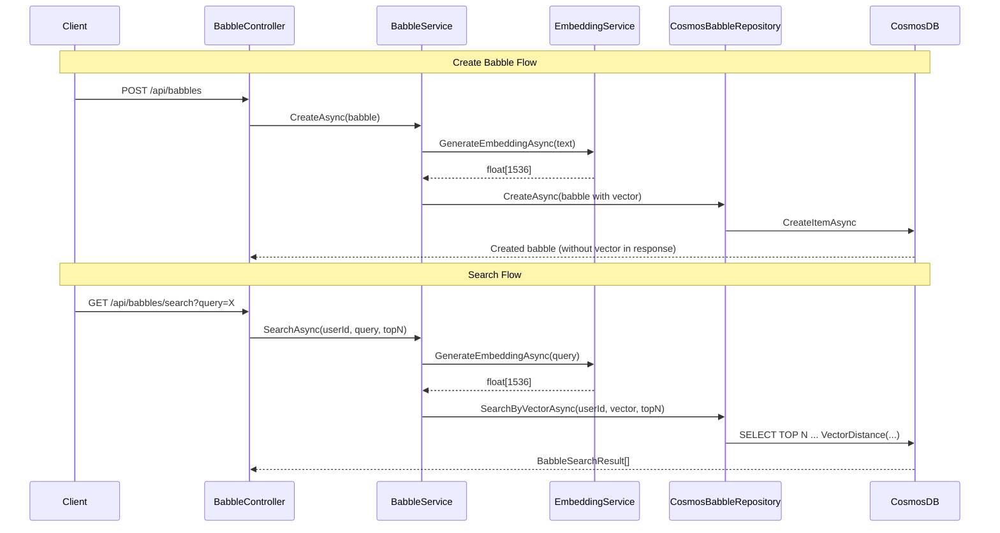

<!-- markdownlint-disable-file -->
# Task Research: Implement Search Functionality

Complete the end-to-end semantic search feature for babbles. The infrastructure (Cosmos DB vector index, `EmbeddingService`, `useSemanticSearch` hook, `SearchCommand` component) partially exists but is not wired together.

## Task Implementation Requests

* Add `contentVector` property to the `Babble` domain model
* Register `IEmbeddingService` and `IEmbeddingGenerator` in DI
* Generate embeddings on babble create/update in `BabbleService`
* Add a vector search endpoint (`GET /api/babbles/search`) to `BabbleController`
* Mount the `SearchCommand` component in the React app shell

## Scope and Success Criteria

* Scope: Backend embedding generation, vector storage, vector search query, frontend mounting of existing search UI. Excludes changes to Cosmos Bicep (already configured), `EmbeddingService` implementation (already complete), `SearchCommand` component logic (already complete).
* Assumptions:
  * Azure OpenAI embedding model deployment exists (text-embedding-ada-002 or text-embedding-3-small, 1536 dimensions per Bicep config)
  * The `IEmbeddingGenerator<string, Embedding<float>>` will be provided by the `Microsoft.Extensions.AI.AzureAIInference` or Aspire integration
  * Embedding should be generated asynchronously but inline (not background job) on create/update
* Success Criteria:
  * Creating or updating a babble stores a 1536-dim vector in `contentVector`
  * `GET /api/babbles/search?query=X&topK=N` returns ranked results with similarity scores
  * `Ctrl+K` opens the search dialog in the React app
  * All existing unit tests continue to pass
  * New unit tests cover embedding generation in service layer and search endpoint

## Outline

1. Domain Model Changes (Babble.cs)
2. DI Registration (EmbeddingService + IEmbeddingGenerator)
3. BabbleService Changes (embedding on create/update)
4. BabbleController Search Endpoint
5. IBabbleRepository Vector Search Method
6. CosmosBabbleRepository Vector Search Implementation
7. Frontend: Mount SearchCommand
8. Unit Tests

## Potential Next Research

* Background re-vectorization job for existing babbles without vectors
  * Reasoning: Existing babbles won't have vectors; need a migration path
  * Reference: CosmosBabbleRepository.cs, cosmos-babbles-vector-container.bicep
* Embedding model fallback/retry strategy
  * Reasoning: Azure OpenAI rate limits could fail embedding generation
  * Reference: EmbeddingService.cs

## Research Executed

### File Analysis

* prompt-babbler-service/src/Orchestration/AppHost/AppHost.cs (lines 1–75)
  * Only a `"chat"` model deployment exists. No embedding deployment configured.
  * Uses `Aspire.Hosting.Foundry` pattern: `foundryProject.AddModelDeployment()` → `.WithReference()` to API.
* prompt-babbler-service/src/Api/Program.cs (lines 65–115)
  * Manually creates `AzureOpenAIClient`, calls `.GetChatClient("chat").AsIChatClient()`, registers both as singletons.
  * The `AzureOpenAIClient` singleton is already registered — reusable for `.GetEmbeddingClient()`.
  * No `IEmbeddingGenerator` registration exists.
* prompt-babbler-service/src/Infrastructure/DependencyInjection.cs
  * `IEmbeddingService` is NOT registered. All other services are registered.
* prompt-babbler-service/src/Infrastructure/Services/EmbeddingService.cs
  * Fully implemented. Accepts `IEmbeddingGenerator<string, Embedding<float>>` via ctor.
* prompt-babbler-service/src/Infrastructure/Services/BabbleService.cs (lines 41–44)
  * `CreateAsync` delegates directly to repository — no embedding generation.
* prompt-babbler-service/src/Infrastructure/Services/CosmosBabbleRepository.cs
  * Uses `StringBuilder` + `QueryDefinition` with params. No vector methods.
* prompt-babbler-service/src/Domain/Models/Babble.cs
  * No `contentVector` property.
* prompt-babbler-service/src/Domain/Models/BabbleSearchResult.cs
  * Already defined: `BabbleSearchResult(Babble Babble, double SimilarityScore)`
* prompt-babbler-service/src/Api/Models/Responses/BabbleSearchResponse.cs
  * Already defined: `BabbleSearchResultItem` and `BabbleSearchResponse`
* infra/cosmos-babbles-vector-container.bicep
  * Vector index: `/contentVector`, quantizedFlat, Float32, Cosine, 1536 dims. Already deployed.
* prompt-babbler-app/src/components/search/SearchCommand.tsx
  * Fully implemented but NOT mounted anywhere in App.tsx.
* prompt-babbler-app/src/App.tsx
  * SearchCommand must be inside `<BrowserRouter>` (uses `useNavigate`).
* prompt-babbler-app/src/services/api-client.ts (line 355)
  * `searchBabbles()` calls `GET /api/babbles/search?query=X&topK=N`
* prompt-babbler-app/src/types/index.ts
  * `BabbleSearchResultItem` and `BabbleSearchResponse` types already defined.
* prompt-babbler-service/Directory.Packages.props
  * `Azure.AI.OpenAI` 2.1.0 and `Microsoft.Extensions.AI.OpenAI` 10.5.0 — both support embeddings, no new packages needed.

### Project Conventions

* Standards referenced: sealed classes, `_camelCase` fields, `[JsonPropertyName]` on models, `[Authorize]` + `[RequiredScope]` on controllers
* Instructions followed: AGENTS.md, .github/copilot-instructions.md

## Key Discoveries

### Project Structure

The search feature is split across 4 layers that need connected:
1. **Infrastructure (Cosmos Bicep)** — DONE: vector index configured
2. **Domain (interfaces + models)** — PARTIAL: `IEmbeddingService`, `BabbleSearchResult` exist; `Babble` model missing vector property, `IBabbleRepository`/`IBabbleService` missing search methods
3. **Infrastructure (services)** — PARTIAL: `EmbeddingService` implemented but not registered; `CosmosBabbleRepository` lacks vector search method
4. **API (controllers)** — MISSING: no `/api/babbles/search` endpoint
5. **Frontend** — PARTIAL: `SearchCommand`, `useSemanticSearch`, `searchBabbles` all exist but `SearchCommand` is not mounted

### Implementation Patterns

Existing pattern for AI client registration (Program.cs):
```csharp
var openAiClient = new AzureOpenAIClient(accountEndpoint, runtimeTokenCredential);
var chatClient = openAiClient.GetChatClient("chat").AsIChatClient();
builder.Services.AddSingleton<IChatClient>(chatClient);
builder.Services.AddSingleton(openAiClient);
```

For embedding, the same `openAiClient` singleton can produce:
```csharp
var embeddingClient = openAiClient.GetEmbeddingClient("embedding").AsIEmbeddingGenerator();
builder.Services.AddSingleton<IEmbeddingGenerator<string, Embedding<float>>>(embeddingClient);
```

Cosmos vector search query pattern:
```sql
SELECT TOP @topN c.id, c.userId, c.title, c.text, c.createdAt, c.tags, c.updatedAt, c.isPinned,
    VectorDistance(c.contentVector, @embedding) AS SimilarityScore
FROM c WHERE c.userId = @userId
ORDER BY VectorDistance(c.contentVector, @embedding)
```

### Complete Examples

**BabbleService with embedding (create flow):**
```csharp
public sealed class BabbleService : IBabbleService
{
    private readonly IBabbleRepository _babbleRepository;
    private readonly IEmbeddingService _embeddingService;
    // ...

    public async Task<Babble> CreateAsync(Babble babble, CancellationToken cancellationToken = default)
    {
        var vector = await _embeddingService.GenerateEmbeddingAsync(babble.Text, cancellationToken);
        var babbleWithVector = babble with { ContentVector = vector.ToArray() };
        return await _babbleRepository.CreateAsync(babbleWithVector, cancellationToken);
    }
}
```

**App.tsx mount point:**
```tsx
<BrowserRouter>
  <BrowserCheck />
  <PageLayout>
    <Routes>...</Routes>
  </PageLayout>
  <SearchCommand />
  <ThemedToaster />
</BrowserRouter>
```

### API and Schema Documentation

* Backend endpoint needed: `GET /api/babbles/search?query={string}&topK={int}`
* Response schema: `{ results: [{ id, title, snippet, tags?, createdAt, isPinned, score }] }`
* Cosmos vector path: `/contentVector` (Float32, 1536 dims, Cosine distance)

### Configuration Examples

**AppHost embedding deployment:**
```csharp
var embeddingDeployment = foundryProject.AddModelDeployment(
    "embedding",
    builder.Configuration["MicrosoftFoundry:embeddingModelName"] ?? "text-embedding-3-small",
    builder.Configuration["MicrosoftFoundry:embeddingModelVersion"] ?? "1",
    "OpenAI")
    .WithProperties(deployment => {
        deployment.SkuName = "Standard";
        deployment.SkuCapacity = 120;
    });
```

**launchSettings.json additions:**
```json
"MicrosoftFoundry__embeddingModelName": "text-embedding-3-small",
"MicrosoftFoundry__embeddingModelVersion": "1"
```

## Technical Scenarios

### Scenario: Embedding generation on babble create/update

When a babble is created or its text is updated, generate a 1536-dim embedding from the text and store it in the `contentVector` field.

**Requirements:**

* Must not block the create/update response excessively (embedding call ~100–200ms)
* Must handle embedding service failures gracefully (babble still saved without vector)
* Existing babbles without vectors must still function normally
* Vector must be excluded from API response serialization (1536 floats = ~6KB per response)

**Preferred Approach:**

* Inline embedding generation in `BabbleService.CreateAsync`/`UpdateAsync` with try-catch fallback
* On failure: log warning, save babble without vector (search won't find it until re-vectorized)
* `ContentVector` on `Babble` is nullable (`float[]?`) and excluded from response DTO via projection in `ToResponse()`

```text
prompt-babbler-service/
├── src/
│   ├── Domain/
│   │   ├── Models/Babble.cs                    # Add ContentVector property
│   │   ├── Interfaces/IBabbleRepository.cs     # Add SearchByVectorAsync
│   │   └── Interfaces/IBabbleService.cs        # Add SearchAsync
│   ├── Infrastructure/
│   │   ├── DependencyInjection.cs              # Register IEmbeddingService
│   │   └── Services/
│   │       ├── BabbleService.cs                # Inject IEmbeddingService, embed on create/update
│   │       └── CosmosBabbleRepository.cs       # Add SearchByVectorAsync implementation
│   ├── Api/
│   │   ├── Program.cs                          # Register IEmbeddingGenerator
│   │   └── Controllers/BabbleController.cs     # Add search endpoint
│   └── Orchestration/
│       └── AppHost/AppHost.cs                  # Add embedding deployment
```



**Implementation Details:**

8 files need changes across backend + 1 frontend file:

| # | File | Change |
|---|------|--------|
| 1 | `Domain/Models/Babble.cs` | Add `ContentVector` property (`float[]?`, `[JsonPropertyName("contentVector")]`) |
| 2 | `Domain/Interfaces/IBabbleRepository.cs` | Add `SearchByVectorAsync` method signature |
| 3 | `Domain/Interfaces/IBabbleService.cs` | Add `SearchAsync` method signature |
| 4 | `Infrastructure/DependencyInjection.cs` | Register `IEmbeddingService` → `EmbeddingService` |
| 5 | `Infrastructure/Services/BabbleService.cs` | Inject `IEmbeddingService`, embed on create/update, implement `SearchAsync` |
| 6 | `Infrastructure/Services/CosmosBabbleRepository.cs` | Implement `SearchByVectorAsync` with VectorDistance query |
| 7 | `Api/Program.cs` | Register `IEmbeddingGenerator<string, Embedding<float>>` from `openAiClient.GetEmbeddingClient("embedding")` |
| 8 | `Api/Controllers/BabbleController.cs` | Add `[HttpGet("search")]` endpoint |
| 9 | `Orchestration/AppHost/AppHost.cs` | Add embedding model deployment + pass to API |
| 10 | `prompt-babbler-app/src/App.tsx` | Import + render `<SearchCommand />` inside BrowserRouter |

#### Considered Alternatives

**Alternative A: Background job for embedding generation**
- Pros: Non-blocking create/update, retries built-in
- Cons: Search results delayed, more infrastructure (queue/worker), over-engineered for MVP
- Rejected: Inline with graceful fallback is simpler and sufficient for expected load

**Alternative B: Client-side embedding (browser WebGPU)**
- Pros: No backend embedding cost
- Cons: Large model download, inconsistent browser support, different embedding model than backend
- Rejected: Not practical for production semantic search

**Alternative C: Separate embedding container in Cosmos**
- Pros: Clean separation, independent indexing policy
- Cons: Data duplication, cross-container joins not possible, more complexity
- Rejected: Bicep already configures vector index on the `babbles` container itself
