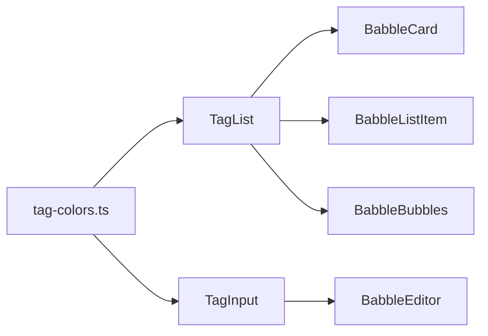

<!-- markdownlint-disable-file -->
# Task Research: Babble Tags Feature — Set, Update, and Display with Colored Bubbles

Add a feature to set and update tags for each babble. Tags should be displayed as colored bubbles using a standard Shadcn/UI component. Tags must be editable inline with the babble.

## Task Implementation Requests

* Display tags as colored bubbles/badges alongside babbles in all views (BabbleCard, BabbleListItem, BabbleBubbles)
* Allow users to set and update tags for each babble using a standard Shadcn/UI component
* Use deterministic color assignment for tags so the same tag always appears in the same color

## Scope and Success Criteria

* Scope: Frontend tag display with colors; frontend tag editing UX. Backend already supports tags (no backend changes needed).
* Assumptions:
  * Tags are free-form strings (no predefined tag set/taxonomy)
  * The same tag text should always render in the same color (deterministic hash-based coloring)
  * Backend already has `Tags` property on the Babble model, accepts tags in Create/Update requests, and returns them in responses
  * The existing `TagInput` and `TagList` components are the starting point
* Success Criteria:
  * Tags display as colored pill-shaped badges in all babble views
  * Color is deterministic per tag name (same tag = same color everywhere)
  * Tags can be added/removed in the BabbleEditor using a standard Shadcn/UI component
  * No backend changes required

## Outline

1. Current state analysis
2. Component selection for display and editing
3. Color mapping strategy
4. Implementation approach (selected)
5. Alternatives considered

## Confirmed: No Inline Tag Editing in Card/ListItem/Bubbles Views

**Tags cannot be set or edited within BabbleCard, BabbleListItem, or BabbleBubbles.** These components are strictly read-only display using `TagList`.

### Current Tag Editing Journey

1. Create babble via RecordPage → **no tags can be set** (RecordPage doesn't pass tags to `createBabble`)
2. Navigate to babble detail page (`/babble/:id`)
3. Click "Edit Text" button → `isEditing = true`
4. `BabbleEditor` renders with Textarea + `TagInput`
5. Add/remove tags in `TagInput`
6. Click "Save" → API update includes tags
7. Back to read-only view with `TagList`

### Evidence

| Component | Tags Editable? | Mechanism |
|---|---|---|
| BabbleCard | No | Read-only `TagList`; entire card is a navigation link |
| BabbleListItem | No | Read-only `TagList`; only interactive element is pin button |
| BabbleBubbles | No | Read-only `TagList`; only interactive element is pin button |
| BabbleEditor | **Yes** | `TagInput` with full add/remove UX |
| BabblePage (not editing) | No | `TagList` display; tags hidden behind "Edit Text" button |
| RecordPage (creation) | No | No `TagInput`; `createBabble({ title, text })` without tags |

### `TagInput` Usage (exhaustive)

Only 2 source files import `TagInput`:
- `src/components/babbles/BabbleEditor.tsx` — babble tag editing
- `src/components/templates/TemplateEditor.tsx` — template tag editing (separate domain)

### UX Gap Identified

To set tags, a user must: navigate to babble detail → enter full edit mode → set tags → save. There is no way to:
- Set tags during creation
- Edit tags without also entering text-edit mode
- Quick-add tags from the list/card/bubble views

## Potential Next Research

* Investigate adding tag autocomplete/suggestions from existing user tags
  * Reasoning: UX improvement for power users with many babbles
  * Reference: Combobox component in Shadcn/UI
* Investigate filtering babbles by tag
  * Reasoning: Natural follow-up feature once tags are visually prominent
  * Reference: BabbleListSection search/filter logic
* Investigate adding inline tag editing to BabblePage without entering full edit mode
  * Reasoning: Users should be able to add/remove tags without editing the babble text
  * Reference: BabblePage.tsx L288-312, could add a dedicated "Edit Tags" button or always-visible TagInput
* Investigate adding tags to the RecordPage creation flow
  * Reasoning: Tags set at creation time avoids requiring a separate edit step
  * Reference: RecordPage.tsx saveBabble function, API already accepts tags

## Research Executed

### File Analysis

* `prompt-babbler-service/src/Domain/Models/Babble.cs`
  * Lines 26-27: `Tags` property is `IReadOnlyList<string>?` with `[JsonPropertyName("tags")]`
  * Backend already fully supports tags in CRUD operations
* `prompt-babbler-service/src/Api/Controllers/BabbleController.cs`
  * Validation: max 20 tags, each max 50 chars, non-whitespace
  * Tags included in CreateBabbleRequest, UpdateBabbleRequest, BabbleResponse
* `prompt-babbler-app/src/types/index.ts`
  * `Babble` interface has `tags?: string[]`
* `prompt-babbler-app/src/components/ui/tag-list.tsx` (20 lines)
  * Renders tags as `Badge variant="outline"` — uniform grey, no colors
* `prompt-babbler-app/src/components/ui/tag-input.tsx` (138 lines)
  * Full-featured input: comma-splitting, keyboard nav, paste, max constraints
  * Uses `Badge variant="secondary"` with X button for removal
* `prompt-babbler-app/src/components/ui/badge.tsx` (48 lines)
  * Standard shadcn/ui badge with CVA variants: default, secondary, destructive, outline, ghost, link
  * Accepts `className` for custom colors
  * `rounded-full` pill shape
* `prompt-babbler-app/src/components/babbles/BabbleCard.tsx` (line 39)
  * Uses `<TagList tags={babble.tags} className="mt-2" />`
* `prompt-babbler-app/src/components/babbles/BabbleListItem.tsx` (line 38)
  * Uses `<TagList tags={babble.tags} className="mt-1" />`
* `prompt-babbler-app/src/components/babbles/BabbleBubbles.tsx` (line 62)
  * Uses `<TagList tags={babble.tags} className="mt-2" />`
* `prompt-babbler-app/src/components/babbles/BabbleEditor.tsx` (lines 39-46)
  * Uses `<TagInput>` for editing tags with maxTags=20, maxTagLength=50
* `prompt-babbler-app/src/hooks/useBabbles.ts`
  * CRUD operations pass tags through to API — no changes needed

### External Research

* Shadcn/UI Badge: https://ui.shadcn.com/docs/components/badge
  * Badge supports `className` override for custom background/text colors via Tailwind
* Shadcn/UI Combobox: https://ui.shadcn.com/docs/components/combobox
  * Supports `multiple` prop for multi-select with chips
  * Not currently installed in project
  * Overkill for free-form tags without autocomplete from a predefined set

### Project Conventions

* Standards referenced: Shadcn/UI + Tailwind CSS, Badge component as tag primitive
* Instructions followed: Use `@/` path alias, named exports, no global state, components in `src/components/`

## Key Discoveries

### Project Structure

* Tags are ALREADY supported end-to-end (backend model → API → frontend types → display/edit)
* The missing piece is **colored display** — currently all tags are uniform grey
* The `TagList` component is the single point of change for display coloring
* The `TagInput` component could also benefit from colored badges for consistency

### Implementation Patterns

* Badge accepts `className` for arbitrary Tailwind classes — this is the standard way to add colors
* No tag color mapping exists anywhere in the codebase
* All 3 display components (BabbleCard, BabbleListItem, BabbleBubbles) use the same `<TagList>` component — a single change propagates everywhere

### Complete Examples

#### Deterministic Tag Color Utility

```typescript
// src/lib/tag-colors.ts
const TAG_COLORS = [
  'bg-red-100 text-red-800 dark:bg-red-900 dark:text-red-200',
  'bg-orange-100 text-orange-800 dark:bg-orange-900 dark:text-orange-200',
  'bg-amber-100 text-amber-800 dark:bg-amber-900 dark:text-amber-200',
  'bg-yellow-100 text-yellow-800 dark:bg-yellow-900 dark:text-yellow-200',
  'bg-lime-100 text-lime-800 dark:bg-lime-900 dark:text-lime-200',
  'bg-green-100 text-green-800 dark:bg-green-900 dark:text-green-200',
  'bg-emerald-100 text-emerald-800 dark:bg-emerald-900 dark:text-emerald-200',
  'bg-teal-100 text-teal-800 dark:bg-teal-900 dark:text-teal-200',
  'bg-cyan-100 text-cyan-800 dark:bg-cyan-900 dark:text-cyan-200',
  'bg-sky-100 text-sky-800 dark:bg-sky-900 dark:text-sky-200',
  'bg-blue-100 text-blue-800 dark:bg-blue-900 dark:text-blue-200',
  'bg-indigo-100 text-indigo-800 dark:bg-indigo-900 dark:text-indigo-200',
  'bg-violet-100 text-violet-800 dark:bg-violet-900 dark:text-violet-200',
  'bg-purple-100 text-purple-800 dark:bg-purple-900 dark:text-purple-200',
  'bg-fuchsia-100 text-fuchsia-800 dark:bg-fuchsia-900 dark:text-fuchsia-200',
  'bg-pink-100 text-pink-800 dark:bg-pink-900 dark:text-pink-200',
  'bg-rose-100 text-rose-800 dark:bg-rose-900 dark:text-rose-200',
] as const;

function hashString(str: string): number {
  let hash = 0;
  for (let i = 0; i < str.length; i++) {
    const char = str.charCodeAt(i);
    hash = ((hash << 5) - hash) + char;
    hash |= 0; // Convert to 32-bit integer
  }
  return Math.abs(hash);
}

export function getTagColor(tag: string): string {
  const index = hashString(tag.toLowerCase()) % TAG_COLORS.length;
  return TAG_COLORS[index];
}
```

#### Updated TagList (display with colors)

```tsx
// src/components/ui/tag-list.tsx
import { Badge } from '@/components/ui/badge';
import { getTagColor } from '@/lib/tag-colors';

interface TagListProps {
  tags: string[] | undefined;
  className?: string;
}

export function TagList({ tags, className }: TagListProps) {
  if (!tags || tags.length === 0) return null;

  return (
    <div className={`flex flex-wrap gap-1 ${className ?? ''}`}>
      {tags.map((tag) => (
        <Badge key={tag} variant="outline" className={`text-xs border-transparent ${getTagColor(tag)}`}>
          {tag}
        </Badge>
      ))}
    </div>
  );
}
```

#### Updated TagInput (editing with colors)

```tsx
// Key change in tag-input.tsx: add color to displayed badges
import { getTagColor } from '@/lib/tag-colors';

// In the render, change badge line from:
<Badge key={`${tag}-${index}`} variant="secondary" className="gap-1 pr-1">
// To:
<Badge key={`${tag}-${index}`} variant="secondary" className={`gap-1 pr-1 border-transparent ${getTagColor(tag)}`}>
```

### API and Schema Documentation

* Backend requires no changes — tags are already a first-class field
* Validation constraints: max 20 tags, max 50 chars each, trimmed, non-empty
* Tags are included in all babble responses (BabbleResponse, BabbleSearchResultItem)

### Configuration Examples

No new dependencies or configuration needed. Tailwind already includes all color utilities used.

## Technical Scenarios

### Scenario: Add Deterministic Colored Tags to Babble Display

Users want tags to be visually distinguishable. The same tag should always appear in the same color across all views for quick visual recognition.

**Requirements:**

* Tags render as colored pill badges in BabbleCard, BabbleListItem, BabbleBubbles
* Color assignment is deterministic (hash-based on tag name)
* Dark mode support
* Existing TagInput shows colors during editing for consistency
* No backend changes

**Preferred Approach: Hash-Based Color Utility + Badge className Override**

* Create a `getTagColor()` utility that maps tag strings to Tailwind color classes via a hash function
* Modify `TagList` to apply the color class to each Badge
* Modify `TagInput` to apply the color class to each editable Badge
* Single utility file, minimal changes, works everywhere automatically

```text
prompt-babbler-app/
├── src/
│   ├── lib/
│   │   └── tag-colors.ts          # NEW: hash-based color utility
│   └── components/
│       └── ui/
│           ├── tag-list.tsx        # MODIFIED: apply getTagColor()
│           └── tag-input.tsx       # MODIFIED: apply getTagColor()
```



**Implementation Details:**

1. **Create `src/lib/tag-colors.ts`** — A utility that:
   - Defines a palette of 17 distinct Tailwind color class combinations (light + dark mode)
   - Uses a simple string hash (djb2-style) to deterministically map any tag string to a palette index
   - Exports `getTagColor(tag: string): string` returning the Tailwind classes

2. **Modify `src/components/ui/tag-list.tsx`** — Import `getTagColor` and apply it to each Badge's `className`. Change from `variant="outline"` with default border to colored background.

3. **Modify `src/components/ui/tag-input.tsx`** — Import `getTagColor` and apply it to each Badge's `className` in the editable list.

4. **No changes to**: BabbleCard, BabbleListItem, BabbleBubbles, BabbleEditor, useBabbles, backend — they all inherit the change via TagList/TagInput.

**Testing:**
- Add a unit test for `getTagColor` verifying determinism and boundary cases
- Visual verification in existing components

#### Considered Alternatives

**Alternative 1: Combobox Multi-Select (Not Selected)**
- Install `combobox` from Shadcn/UI for tag editing with autocomplete
- Pros: Better UX for selecting from existing tags; native chip display
- Cons: Requires installing a new component; more complex; needs an API endpoint to list all user tags for autocomplete; free-form entry is less natural
- Verdict: Overkill for the current request which focuses on display colors. The existing TagInput already works well for free-form tags. Combobox could be a future enhancement for autocomplete.

**Alternative 2: User-Selectable Tag Colors (Not Selected)**
- Let users pick a color for each tag; store color metadata alongside the tag
- Pros: Full user control over tag appearance
- Cons: Requires backend schema change (tags become objects, not strings); migration needed; much more complex UI; increases storage
- Verdict: Over-engineered for the request. Deterministic hash-based coloring is simpler and provides visual differentiation without user effort.

**Alternative 3: Predefined Tag Categories (Not Selected)**
- Define a fixed set of tag categories with assigned colors
- Pros: Consistent colors; better for shared/team taxonomies
- Cons: Limits tag creativity; requires maintenance of category list; not what was requested
- Verdict: Contradicts the free-form tag model already in place.
