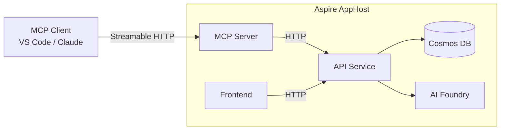

<!-- markdownlint-disable-file -->
# Task Research: MCP Server for Prompt Babbler

Add a new `PromptBabbler.McpServer` C# .NET project that provides a remote MCP (Model Context Protocol) server, hosted in Azure Container Apps alongside the API. The MCP server exposes Prompt Babbler data and operations to AI assistants via the MCP protocol, communicating exclusively through the existing REST API.

## Task Implementation Requests

* Create a new `PromptBabbler.McpServer` ASP.NET Core project under `prompt-babbler-service/src/McpServer/`
* Use the MCP C# SDK (`ModelContextProtocol.AspNetCore`) with Streamable HTTP transport
* Implement MCP Tools for babble search/read, prompt template CRUD, generated prompt read, and prompt generation
* Implement MCP Resources for browsable data (templates, babbles)
* Implement MCP Prompts for common prompt-generation workflows
* Create a typed HTTP client library for API communication with Aspire service discovery
* Support three auth modes: anonymous, access code (bearer), and Entra ID (OAuth 2.1 with OBO)
* Integrate into the Aspire AppHost alongside the API
* Add the project to the solution file

## Scope and Success Criteria

* Scope: New project creation, Aspire integration, MCP primitive implementation, auth configuration. Does NOT include deployment infrastructure (Bicep/Terraform), Entra ID app registration creation, or unit tests (separate task).
* Assumptions:
  * Target framework: .NET 10.0 (matches existing projects)
  * The MCP server is stateless (no server-to-client requests needed)
  * Authentication mode mirrors the API configuration
  * The MCP server gets its own Entra ID app registration (deferred to implementation)
* Success Criteria:
  * MCP server starts and serves the `/mcp` endpoint via Streamable HTTP
  * All babble/template/prompt operations accessible as MCP Tools
  * Templates exposed as MCP Resources for browsing
  * Prompt generation templates exposed as MCP Prompts
  * Auth works in anonymous mode for local development
  * Aspire AppHost orchestrates the MCP server alongside the API
  * Project follows all existing conventions (sealed classes, naming, central packages)

## Outline

1. Project Structure and Setup
2. MCP Primitive Mapping (Tools, Resources, Prompts)
3. Typed HTTP Client Library Design
4. Authentication Architecture
5. Aspire Integration
6. Solution/Build Integration

## Potential Next Research

* OBO flow implementation with Microsoft.Identity.Web for Entra ID mode
  * Reasoning: Complex token exchange pattern needed for production auth
  * Reference: https://learn.microsoft.com/entra/identity-platform/v2-oauth2-on-behalf-of-flow
* MCP server Entra ID app registration requirements
  * Reasoning: Need to define scopes, permissions, and API exposure
  * Reference: Entra ID docs
* Rate limiting and abuse protection for the MCP endpoint
  * Reasoning: MCP tools can be called repeatedly by AI agents
  * Reference: ASP.NET Core rate limiting middleware
* ~~Docker/Container configuration for Azure Container Apps deployment~~ — **Researched** (see Scenario 5)
  * Findings: The API uses a 3-stage multi-stage Dockerfile (`prompt-babbler-service/src/Api/Dockerfile`); the MCP server needs its own Dockerfile following the same pattern but omitting the Speech SDK native deps. `azure.yaml` needs a new `mcp-server` service entry. Container App resource follows the `ca-{environmentName}-mcp-server` naming pattern.
  * Source: `prompt-babbler-service/src/Api/Dockerfile`, `azure.yaml`, `infra/main.bicep` (DR-03 subagent)

## Research Executed

### File Analysis

* `prompt-babbler-service/src/Orchestration/AppHost/AppHost.cs`
  * Lines 57–110: Cosmos containers, API project registration with all references, frontend Vite app
  * Pattern for adding new projects: `builder.AddProject<Projects.X>("name").WithReference(apiService).WaitFor(apiService)`
  * Lines 66–84: `apiService` uses only double-underscore env vars via `.WithEnvironment()` — no `ACCESS_CODE` is passed here; it is set externally as an OS env var and bridged by explicit code in the API's `Program.cs`
* `prompt-babbler-service/src/Api/Program.cs`
  * Auth setup: AddMicrosoftIdentityWebApi when ClientId configured, anonymous fallback, AccessCodeMiddleware
  * Pipeline: ExceptionHandler → CORS → AccessCode → WebSockets → Auth → Authorization → Controllers
  * Lines 14–18: Explicit bridging workaround — reads `ACCESS_CODE` OS env var and injects it into `builder.Configuration["AccessControl:AccessCode"]`. This is NOT a pattern to replicate; it exists because `ACCESS_CODE` is an unconventional flat name.
* `prompt-babbler-service/src/Api/Middleware/AccessCodeMiddleware.cs`
  * Reads exclusively from `IOptionsMonitor<AccessControlOptions>` (DI/config). Zero direct `Environment.GetEnvironmentVariable()` calls. The config key `AccessControl:AccessCode` must be populated for enforcement to activate.
* `prompt-babbler-service/Directory.Build.props`
  * net10.0, ImplicitUsings, Nullable, TreatWarningsAsErrors, EnforceCodeStyleInBuild
* `prompt-babbler-service/Directory.Packages.props`
  * Central package management with transitive pinning
* `prompt-babbler-service/PromptBabbler.slnx`
  * Solution structure: /src/, /tests/unit/, /tests/integration/ folders
* `prompt-babbler-service/src/Api/Dockerfile`
  * 3-stage multi-stage build: `base` → `build` → `final`
  * Base image: `mcr.microsoft.com/dotnet/aspnet:10.0-noble`; SDK image: `mcr.microsoft.com/dotnet/sdk:10.0`
  * Port `8080` (matches ACA ingress target port)
  * Installs Speech SDK native deps (`libasound2t64`, `libssl3t64`) in base stage — **MCP server does not need these**
  * Copies `Directory.Build.props` + `Directory.Packages.props` before `.csproj` files (NuGet restore layer caching)
  * Copies only `.csproj` files before `dotnet restore`, then copies source (Docker layer cache optimisation)
  * Publish: `-c Release --no-restore`, output `/app/publish`; entrypoint: `dotnet PromptBabbler.Api.dll`
  * Build context: `./prompt-babbler-service/` (root of service folder)
* `prompt-babbler-service/.dockerignore`
  * Excludes `**/bin/`, `**/obj/`, `**/TestResults/`, `**/.vs/`
* `azure.yaml`
  * `api` service: `host: containerapp`, `language: dotnet`, Dockerfile relative to project dir, context `../../` (= `prompt-babbler-service/`)
  * MCP server entry would be: `mcp-server: host: containerapp, language: dotnet, project: ./prompt-babbler-service/src/McpServer`
  * `azd` uses `azd-service-name` tag on Container App to identify deployment target
* `infra/main.bicep`
  * AVM module `br/public:avm/res/app/container-app:0.22.1` for the API Container App
  * Naming pattern: `ca-{environmentName}-{service}` (e.g. `ca-myenv-api`)
  * Config: 0.5 CPU / 1Gi memory; scale 0–3; external ingress; `ingressTransport: 'auto'`; port 8080; system-assigned managed identity
  * Env vars use double-underscore hierarchy convention (`AzureAd__ClientId`, `ConnectionStrings__cosmos`, etc.) — except `ACCESS_CODE` which uses a flat name and is a historical workaround

### Code Search Results

* `[McpServerToolType]` — SDK attribute for tool classes
* `[McpServerPromptType]` — SDK attribute for prompt classes
* `[McpServerResourceType]` — SDK attribute for resource classes
* `WithHttpTransport()` — Enables Streamable HTTP transport
* `MapMcp()` — Maps MCP endpoint (default `/mcp`)
* `.AddMcp()` — Auth builder extension for Protected Resource Metadata
* `McpAuthenticationDefaults.AuthenticationScheme` — MCP challenge scheme

### External Research

* MCP C# SDK: https://github.com/modelcontextprotocol/csharp-sdk
  * v1.2.0, packages: ModelContextProtocol.AspNetCore (pulls in Core + main package)
  * Source: GitHub README + API docs at https://csharp.sdk.modelcontextprotocol.io
* MCP Specification Transports: https://modelcontextprotocol.io/specification/2025-03-26/basic/transports#streamable-http
  * Streamable HTTP: single endpoint, POST for messages, optional SSE for multi-message responses
  * Source: Official MCP spec
* MCP Specification Authorization: https://modelcontextprotocol.io/specification/2025-06-18/basic/authorization
  * OAuth 2.1 based, RFC 9728 Protected Resource Metadata, token passthrough forbidden
  * Source: Official MCP spec
* MCP Security Best Practices: https://modelcontextprotocol.io/specification/2025-06-18/basic/security_best_practices
  * Token passthrough is an anti-pattern; MCP servers MUST use separate tokens for downstream APIs
  * Source: Official MCP spec

### Project Conventions

* Standards referenced: `.github/copilot-instructions.md`, `AGENTS.md`
* Instructions followed: sealed classes, PascalCase types, _camelCase fields, I-prefix interfaces, central package management, all warnings as errors

## Key Discoveries

### Project Structure

The MCP server project will live at `prompt-babbler-service/src/McpServer/` with this layout:

```text
src/McpServer/
├── PromptBabbler.McpServer.csproj
├── Program.cs
├── Tools/
│   ├── BabbleTools.cs           — search, list, get, generate_prompt (calls API)
│   ├── PromptTemplateTools.cs   — list, get, create, update, delete
│   └── GeneratedPromptTools.cs  — list, get
├── Resources/
│   └── TemplateResources.cs     — babbler://templates, babbler://templates/{id}
├── Prompts/
│   └── TemplateReviewPrompt.cs  — User-triggered slash command (static ChatMessage, no API call)
└── Client/
    ├── IPromptBabblerApiClient.cs
    └── PromptBabblerApiClient.cs
```

### Implementation Patterns

The MCP C# SDK uses attribute-based discovery with DI injection:

```csharp
// Tools — main MCP primitive for operations
[McpServerToolType]
public sealed class BabbleTools(IPromptBabblerApiClient apiClient)
{
    [McpServerTool(Name = "search_babbles", ReadOnly = true), Description("Search babbles using semantic/vector search")]
    public async Task<string> SearchBabbles(
        [Description("The search query text")] string query,
        [Description("Maximum results to return (1-50)")] int topK = 10,
        CancellationToken cancellationToken = default)
    {
        var results = await apiClient.SearchBabblesAsync(query, topK, cancellationToken);
        return JsonSerializer.Serialize(results);
    }
}
```

```csharp
// Resources — browsable data
[McpServerResourceType]
public sealed class TemplateResources(IPromptBabblerApiClient apiClient)
{
    [McpServerResource(UriTemplate = "babbler://templates", Name = "Prompt Templates",
        MimeType = "application/json"), Description("All available prompt templates")]
    public async Task<string> GetTemplates(CancellationToken cancellationToken)
    {
        var templates = await apiClient.GetTemplatesAsync(cancellationToken);
        return JsonSerializer.Serialize(templates);
    }
}
```

```csharp
// Prompts — user-triggered conversation starters (slash commands in MCP clients)
// NOTE: These are NOT API-calling actions. They return static ChatMessage arrays
// to seed a conversation. Users explicitly invoke them (e.g., /review_template).
[McpServerPromptType]
public static class TemplateReviewPrompt
{
    [McpServerPrompt(Name = "review_template"),
     Description("Seed a conversation to review and improve a prompt template")]
    public static IEnumerable<ChatMessage> ReviewTemplate(
        [Description("The template instructions text to review")] string instructions,
        [Description("The template description")] string description)
    {
        yield return new ChatMessage(ChatRole.User,
            $"""Please review this prompt template and suggest improvements:

Description: {description}

Instructions:
{instructions}

Evaluate: clarity, completeness, potential edge cases, and effectiveness.""");
    }
}
```

### API and Schema Documentation

**MCP Server Program.cs — Minimal setup:**

```csharp
var builder = WebApplication.CreateBuilder(args);
builder.AddServiceDefaults();

builder.Services.AddMcpServer(options =>
{
    options.ServerInfo = new() { Name = "PromptBabbler.McpServer", Version = "1.0.0" };
    options.ServerInstructions = "Prompt Babbler MCP server. Provides tools for managing babbles (voice transcriptions), prompt templates, and AI-generated prompts produced from babbles.";
})
    .WithHttpTransport(options => options.Stateless = true)
    .WithToolsFromAssembly()
    .WithPromptsFromAssembly()
    .WithResourcesFromAssembly();

// Register typed API client
builder.Services.AddHttpClient<IPromptBabblerApiClient, PromptBabblerApiClient>(client =>
{
    client.BaseAddress = new Uri("https+http://api");
});

var app = builder.Build();
app.MapDefaultEndpoints(); // Aspire health checks
app.MapMcp();
app.Run();
```

### Configuration Examples

**PromptBabbler.McpServer.csproj:**

```xml
<Project Sdk="Microsoft.NET.Sdk.Web">
  <PropertyGroup>
    <RootNamespace>PromptBabbler.McpServer</RootNamespace>
  </PropertyGroup>
  <ItemGroup>
    <PackageReference Include="ModelContextProtocol.AspNetCore" />
    <PackageReference Include="Microsoft.AspNetCore.Authentication.JwtBearer" />
    <PackageReference Include="Microsoft.Identity.Web" />
  </ItemGroup>
  <ItemGroup>
    <ProjectReference Include="..\Orchestration\ServiceDefaults\PromptBabbler.ServiceDefaults.csproj" />
  </ItemGroup>
</Project>
```

**AppHost.csproj addition:**

```xml
<ProjectReference Include="..\..\McpServer\PromptBabbler.McpServer.csproj" />
```

**AppHost.cs addition (after apiService, before frontend):**

```csharp
var mcpServer = builder.AddProject<Projects.PromptBabbler_McpServer>("mcp-server")
    .WithExternalHttpEndpoints()
    .WithReference(apiService)
    .WaitFor(apiService)
    .WithEnvironment("AzureAd__ClientId", mcpClientId)
    .WithEnvironment("AzureAd__TenantId", tenantId)
    .WithEnvironment("AzureAd__Instance", "https://login.microsoftonline.com/")
    .WithEnvironment("AccessControl__AccessCode", builder.Configuration["AccessControl:AccessCode"] ?? "");
```

> **Note:** `AccessControl__AccessCode` uses ASP.NET Core's double-underscore convention (`__` → `:`) which is handled automatically by the built-in `AddEnvironmentVariables()` provider. This eliminates any mapping code in `Program.cs`. The API uses the flat `ACCESS_CODE` name with explicit bridging code (lines 14–18 of `Api/Program.cs`) — that is a historical workaround, not a pattern the MCP server should replicate. Every other hierarchical config value in `AppHost.cs` already uses the double-underscore convention.

## Technical Scenarios

### Scenario 1: MCP Primitive Mapping

Map Prompt Babbler capabilities to MCP primitives (Tools, Resources, Prompts).

**Requirements:**

* All data operations accessible to AI assistants
* Read-only operations clearly marked (ReadOnly = true)
* Destructive operations clearly marked (Destructive = true)
* Semantic search available for babble discovery
* Template browsing available without tool invocation

**Preferred Approach:**

* **Tools** for all CRUD operations and actions (the primary interface for AI)
* **Resources** for browsable/static data (templates list, individual template details)
* **Prompts** for common prompt-generation workflows (generate-from-babble pattern)

```text
Tools/
├── BabbleTools.cs
│   ├── search_babbles (ReadOnly) — Semantic search
│   ├── list_babbles (ReadOnly) — Paginated list
│   ├── get_babble (ReadOnly) — Get by ID
│   └── generate_prompt — Generate prompt from babble + template (calls API, returns result)
├── PromptTemplateTools.cs
│   ├── list_templates (ReadOnly) — All templates
│   ├── get_template (ReadOnly) — Template by ID
│   ├── create_template — Create user template
│   ├── update_template — Update user template
│   └── delete_template (Destructive) — Delete user template
└── GeneratedPromptTools.cs
    ├── list_generated_prompts (ReadOnly) — Prompts for a babble
    └── get_generated_prompt (ReadOnly) — Prompt by ID

Resources/
└── TemplateResources.cs
    ├── babbler://templates — All templates list
    └── babbler://templates/{id} — Individual template (URI template)

Prompts/
└── TemplateReviewPrompt.cs
    └── review_template — User-triggered slash command to seed a template review conversation
```

**MCP Primitive Distinction (from spec):**

| Primitive | Control | Purpose | Prompt Babbler Use |
|-----------|---------|---------|--------------------|
| Tool | Model-controlled | LLM invokes autonomously to call APIs, perform actions, get results | All CRUD + `generate_prompt` |
| Resource | Model-controlled | Browsable data the LLM reads as context | Template catalog |
| Prompt | **User-controlled** | User-triggered slash commands that return static `ChatMessage[]` to seed a conversation | Template review helper |

**`generate_prompt` Tool signature** — takes babble and template identifiers, calls the API, returns result:

```csharp
[McpServerTool(Name = "generate_prompt"), Description("Generate an AI prompt from a babble using a prompt template")]
public async Task<string> GeneratePrompt(
    [Description("The ID of the babble to generate a prompt from")] string babbleId,
    [Description("The ID of the prompt template to use")] string templateId,
    [Description("Output format: 'text' or 'markdown' (optional)")] string? promptFormat = null,
    [Description("Whether to allow emojis in the output (optional)")] bool? allowEmojis = null,
    CancellationToken cancellationToken = default)
{
    var result = await _apiClient.GeneratePromptAsync(babbleId, templateId, promptFormat, allowEmojis, cancellationToken);
    return result; // Full generated prompt text
}
```

**Implementation Details:**

Tools return JSON-serialized API responses. The `generate_prompt` Tool consumes the SSE stream from the API and collects the complete generated text before returning — MCP tools return a single result, not a stream. The tool also saves the generated prompt via a separate API call and returns both the text and the saved prompt ID.

#### Considered Alternatives

**Alternative A: `generate_prompt` as McpServerPromptType**
- Rejected: MCP Prompts are user-controlled and return static `ChatMessage` arrays to seed conversations. They do NOT call APIs or perform actions. `generate_prompt` calls the API and returns a result — it is unambiguously a Tool per the MCP spec ("model-controlled, invoke to interact with external systems").

**Alternative B: Expose everything as Resources only**
- Rejected: Resources are read-only; can't perform mutations or generation
- Resources alone don't allow the AI to create/update/delete templates

**Alternative C: Skip Resources, use only Tools**
- Rejected: Resources provide a browsable catalog that MCP clients can show without tool invocation
- Templates are a natural fit for Resources (relatively static, useful as context)

---

### Scenario 2: Authentication Architecture

Support three auth modes matching the API, compliant with MCP specification.

**Requirements:**

* Anonymous mode for local development (no auth)
* Access code mode for simple protection
* Entra ID mode for production multi-user scenarios
* MCP spec compliance (no token passthrough)
* User identity preserved for per-user data isolation

**Preferred Approach:**

Three-mode auth matching the API, determined by configuration at startup:

| Mode | MCP Endpoint Auth | API Call Auth Strategy |
|------|-------------------|----------------------|
| Anonymous | No auth middleware | No auth headers |
| Access Code | Bearer token = access code | Forward as `X-Access-Code` header |
| Entra ID | JWT Bearer (audience=MCP server) + MCP OAuth metadata | On-Behalf-Of flow → new token (audience=API) |

```csharp
// Program.cs — conditional auth setup
var apiClientId = builder.Configuration["AzureAd:ClientId"];
if (!string.IsNullOrEmpty(apiClientId))
{
    // Entra ID mode
    builder.Services.AddAuthentication(options =>
    {
        options.DefaultChallengeScheme = McpAuthenticationDefaults.AuthenticationScheme;
        options.DefaultAuthenticateScheme = JwtBearerDefaults.AuthenticationScheme;
    })
    .AddMicrosoftIdentityWebApi(builder.Configuration.GetSection("AzureAd"))
    .EnableTokenAcquisitionToCallDownstreamApi()
    .AddInMemoryTokenCaches();

    builder.Services.AddAuthentication()
        .AddMcp(options =>
        {
            options.ResourceMetadata = new()
            {
                AuthorizationServers = { $"https://login.microsoftonline.com/{tenantId}/v2.0" },
                ScopesSupported = ["mcp:tools"],
            };
        });
}
```

**Access Code handling:**
- MCP clients send the access code as `Authorization: Bearer <code>` (standard header MCP clients support)
- MCP server validates the code with constant-time comparison
- MCP server forwards code to API as `X-Access-Code` header
- This is NOT token passthrough (access codes are shared secrets, not OAuth tokens)

**On-Behalf-Of (Entra ID):**
- MCP server receives token issued for itself (audience=MCP server app ID)
- Uses `ITokenAcquisition.GetAccessTokenForUserAsync()` with API scope
- Gets new token with audience=API, preserving user identity
- Includes new token as Bearer in API calls

```text
┌─────────────┐     Bearer (aud=MCP)     ┌─────────────┐     Bearer (aud=API)     ┌─────────┐
│ MCP Client  │ ──────────────────────────▶│ MCP Server  │ ──────────────────────────▶│   API   │
│ (VS Code)   │                            │             │   (OBO flow)              │         │
└─────────────┘                            └─────────────┘                           └─────────┘
```

#### Considered Alternatives

**Alternative A: Service principal (Managed Identity)**
- Rejected: Loses user context; API uses `User.GetObjectId()` for data isolation
- Would require API changes to accept service-to-service calls with user impersonation

**Alternative B: Direct token passthrough**
- Rejected: Explicitly forbidden by MCP specification §3.7
- Would require MCP clients to obtain tokens for the API audience directly

---

### Scenario 3: Typed HTTP Client Design

Create a typed HTTP client for the MCP server to call the API.

**Requirements:**

* Strongly typed request/response models
* Aspire service discovery (`https+http://api` base address)
* Auth header injection based on mode
* Handles pagination (continuation tokens)
* Handles SSE streaming for prompt generation

**Preferred Approach:**

Interface + implementation in the McpServer project (not a shared library yet — single consumer):

```csharp
public interface IPromptBabblerApiClient
{
    // Babbles
    Task<BabbleSearchResponse> SearchBabblesAsync(string query, int topK, CancellationToken ct);
    Task<PagedResponse<BabbleResponse>> ListBabblesAsync(string? continuationToken, int pageSize, CancellationToken ct);
    Task<BabbleResponse?> GetBabbleAsync(string id, CancellationToken ct);

    // Generated Prompts
    Task<PagedResponse<GeneratedPromptResponse>> ListGeneratedPromptsAsync(string babbleId, string? continuationToken, int pageSize, CancellationToken ct);
    Task<GeneratedPromptResponse?> GetGeneratedPromptAsync(string babbleId, string id, CancellationToken ct);

    // Prompt Templates
    Task<IReadOnlyList<PromptTemplateResponse>> GetTemplatesAsync(CancellationToken ct);
    Task<PromptTemplateResponse?> GetTemplateAsync(string id, CancellationToken ct);
    Task<PromptTemplateResponse> CreateTemplateAsync(CreatePromptTemplateRequest request, CancellationToken ct);
    Task<PromptTemplateResponse> UpdateTemplateAsync(string id, UpdatePromptTemplateRequest request, CancellationToken ct);
    Task DeleteTemplateAsync(string id, CancellationToken ct);

    // Generation
    Task<string> GeneratePromptAsync(string babbleId, string templateId, string? promptFormat, bool? allowEmojis, CancellationToken ct);
}
```

The implementation uses `HttpClient` with:
- Aspire service discovery for base URL resolution
- `DelegatingHandler` for auth header injection (access code or OBO token)
- SSE parsing for the generate endpoint (collects full response)

```text
src/McpServer/
├── Client/
│   ├── IPromptBabblerApiClient.cs      — Interface
│   ├── PromptBabblerApiClient.cs       — Implementation
│   ├── ApiAuthDelegatingHandler.cs     — Auth header injection
│   └── Models/                         — Response DTOs (or reference Api project for shared types)
```

**DTO Strategy:** The McpServer will define its own lightweight response DTOs matching the API JSON contracts. This avoids a project reference to `PromptBabbler.Api` (which would pull in all API dependencies) and keeps the MCP server truly decoupled. The DTOs are simple `sealed record` types with `[JsonPropertyName]` attributes.

#### Considered Alternatives

**Alternative A: Shared client library (separate project)**
- Rejected for now: Only one consumer (MCP server); premature abstraction
- Can extract to shared project later if needed (e.g., for CLI tool or integration tests)

**Alternative B: Reference Api project for shared types**
- Rejected: Would create a dependency on the API's full dependency graph (Cosmos SDK, AI SDK, etc.)
- The MCP server should only depend on ServiceDefaults + MCP SDK

---

### Scenario 4: Aspire Integration

Wire the MCP server into the existing AppHost for local development and deployment.

**Requirements:**

* MCP server starts after API is ready
* Service discovery resolves API URL
* Auth environment variables passed through
* External HTTP endpoint for MCP clients to connect

**Preferred Approach:**

```csharp
// In AppHost.cs, after apiService definition, before frontend
var mcpClientId = builder.Configuration["EntraAuth:McpClientId"] ?? "";

var mcpServer = builder.AddProject<Projects.PromptBabbler_McpServer>("mcp-server")
    .WithExternalHttpEndpoints()
    .WithReference(apiService)
    .WaitFor(apiService)
    .WithEnvironment("AzureAd__ClientId", mcpClientId)
    .WithEnvironment("AzureAd__TenantId", tenantId)
    .WithEnvironment("AzureAd__Instance", "https://login.microsoftonline.com/")
    .WithEnvironment("AccessControl__AccessCode", builder.Configuration["AccessControl:AccessCode"] ?? "");
```

> **DR-05 resolved:** `AccessControl__AccessCode` (not `ACCESS_CODE`) is correct. ASP.NET Core's `AddEnvironmentVariables()` converts `__` → `:` automatically, populating `AccessControl:AccessCode` with no mapping code. The API's flat `ACCESS_CODE` + explicit bridging pattern (lines 14–18 of `Api/Program.cs`) is a legacy workaround; the MCP server uses the idiomatic approach consistent with every other Aspire env var.

**Solution file update:**

```xml
<Folder Name="/src/">
  ...existing...
  <Project Path="src/McpServer/PromptBabbler.McpServer.csproj" />
</Folder>
```

```text
Changes needed:
├── prompt-babbler-service/src/McpServer/               — New project
├── prompt-babbler-service/src/Orchestration/AppHost/
│   ├── AppHost.cs                                      — Add mcp-server resource
│   └── PromptBabbler.AppHost.csproj                    — Add ProjectReference
├── prompt-babbler-service/PromptBabbler.slnx           — Add project to solution
└── prompt-babbler-service/Directory.Packages.props     — Add ModelContextProtocol.AspNetCore version
```



#### Considered Alternatives

**Alternative A: MCP server references Cosmos/Foundry directly**
- Rejected: User requirement is that MCP server communicates through the API only
- Keeps architecture clean; single source of truth for business logic in the API

---

### Scenario 5: Container App Deployment (Future Work — DR-03)

Document the Dockerfile and `azure.yaml` patterns needed to deploy the MCP server to Azure Container Apps alongside the API. This scenario is **out of scope for the initial project creation task** but is fully researched here to support the follow-on deployment task.

**Requirements:**

* MCP server built and pushed to GHCR as a container image
* Deployed to Azure Container Apps with external ingress on port 8080
* Environment variables injected at deployment time (access code, Entra ID)
* Scales to zero when idle; up to 3 replicas under load
* `azd` can identify and deploy the service via `azd-service-name` tag

**Preferred Approach:**

* New `Dockerfile` at `prompt-babbler-service/src/McpServer/Dockerfile` modelled after the API Dockerfile but without Speech SDK native deps
* New entry in `azure.yaml` under `services:` for `mcp-server`
* New Bicep module in `infra/main.bicep` for the Container App (mirrors API pattern)

```dockerfile
# prompt-babbler-service/src/McpServer/Dockerfile
FROM mcr.microsoft.com/dotnet/aspnet:10.0-noble AS base
# NOTE: No Speech SDK native deps needed (libasound2t64, libssl3t64) — MCP server does not use Azure Speech
WORKDIR /app
EXPOSE 8080

FROM mcr.microsoft.com/dotnet/sdk:10.0 AS build
WORKDIR /src

COPY Directory.Build.props Directory.Packages.props ./
COPY src/McpServer/PromptBabbler.McpServer.csproj src/McpServer/
COPY src/Domain/PromptBabbler.Domain.csproj src/Domain/
COPY src/Orchestration/ServiceDefaults/PromptBabbler.ServiceDefaults.csproj src/Orchestration/ServiceDefaults/
RUN dotnet restore src/McpServer/PromptBabbler.McpServer.csproj

COPY src/ src/
WORKDIR /src/src/McpServer
RUN dotnet publish -c Release -o /app/publish --no-restore

FROM base AS final
WORKDIR /app
COPY --from=build /app/publish .
ENTRYPOINT ["dotnet", "PromptBabbler.McpServer.dll"]
```

```yaml
# azure.yaml — add mcp-server entry under services:
services:
  api:
    host: containerapp
    language: dotnet
    project: ./prompt-babbler-service/src/Api
    docker:
      path: ./Dockerfile
      context: ../../
  mcp-server:
    host: containerapp
    language: dotnet
    project: ./prompt-babbler-service/src/McpServer
    docker:
      path: ./Dockerfile
      context: ../../
  frontend:
    project: ./prompt-babbler-app
    language: js
    host: staticwebapp
    dist: dist
```

**Bicep Container App for MCP server (infra/main.bicep addition):**

```bicep
// Naming: ca-{environmentName}-mcp-server (follows abbreviations.json pattern)
var mcpServerContainerAppName = '${abbrs.appContainerApps}${environmentName}-mcp-server'

module mcpServerContainerApp 'br/public:avm/res/app/container-app:0.22.1' = {
  params: {
    name: mcpServerContainerAppName
    environmentResourceId: containerAppsEnvironment.outputs.resourceId
    location: location
    tags: union(tags, { 'azd-service-name': 'mcp-server' })
    managedIdentities: { systemAssigned: true }
    containers: [
      {
        name: 'mcp-server'
        image: mcpServerContainerImage  // param: ghcr.io/plagueho/prompt-babbler-mcp-server:latest
        resources: { cpu: json('0.5'), memory: '1Gi' }
        env: [
          { name: 'APPLICATIONINSIGHTS_CONNECTION_STRING', value: appInsights.outputs.connectionString }
          { name: 'AccessControl__AccessCode', secretRef: 'access-code' }  // secure param → secret
          // Conditional Entra ID env vars (if mcpClientId non-empty):
          { name: 'AzureAd__ClientId', value: mcpClientId }
          { name: 'AzureAd__TenantId', value: tenant().tenantId }
          { name: 'AzureAd__Instance', value: environment().authentication.loginEndpoint }
          // API service discovery (Aspire handles this in dev; Bicep needs explicit URL in prod):
          { name: 'services__api__https__0', value: 'https://${apiContainerApp.outputs.fqdn}' }
        ]
      }
    ]
    ingressExternal: true  // or false if MCP clients only connect via API Gateway
    ingressTargetPort: 8080
    ingressTransport: 'auto'
    scaleSettings: { minReplicas: 0, maxReplicas: 3 }
  }
}
```

**Key decisions for the deployment task:**

* **Ingress external vs internal:** The MCP server must have external ingress if MCP clients (VS Code, Claude Desktop) connect directly. If all MCP clients go through an API Gateway, internal ingress is more secure.
* **GHCR image name:** `ghcr.io/plagueho/prompt-babbler-mcp-server` (follows API pattern `ghcr.io/plagueho/prompt-babbler-api`).
* **CI/CD:** A new GitHub Actions job is needed to build and push the MCP server image to GHCR, parallel to the existing API image job.
* **Managed identity RBAC:** MCP server only calls the API over HTTP — no direct Azure service access, so no RBAC role assignments needed for the MCP server's managed identity (beyond pull from GHCR if using a private registry).
* **Environment variable `AccessControl__AccessCode` in Bicep:** Use a Container App secret referencing the `accessCode` Bicep secure param — consistent with the API's `ACCESS_CODE` secret pattern.

#### Considered Alternatives for Container Deployment

**Alternative A: MCP server uses internal ingress, exposed only through API Gateway/APIM**
- Benefits: Stronger perimeter; MCP endpoint not directly internet-accessible
- Trade-offs: Requires APIM or another gateway to be in place; adds latency and cost
- Deferred: Out of scope for the initial deployment task; can be layered on later

**Alternative B: Single Dockerfile for both API and MCP server**
- Rejected: Different project dependencies; MCP server must omit Speech SDK native deps to keep image smaller
- Each service should have its own minimal Dockerfile

---

## Selected Approach Summary

| Aspect | Decision |
|--------|----------|
| **Transport** | Streamable HTTP (stateless mode) |
| **SDK Package** | `ModelContextProtocol.AspNetCore` v1.2.0+ |
| **Project Location** | `prompt-babbler-service/src/McpServer/` |
| **API Communication** | Typed HTTP client with Aspire service discovery |
| **Auth (Anonymous)** | No middleware; no headers to API |
| **Auth (Access Code)** | Bearer token = code; forward as X-Access-Code |
| **Auth (Entra ID)** | JWT Bearer + MCP OAuth metadata + OBO flow |
| **MCP Tools** | 10 tools across 3 tool classes — babbles (search/list/get/**generate_prompt**), templates, generated prompts |
| **MCP Resources** | Template list + individual templates (URI templates) |
| **MCP Prompts** | `review_template` — user-triggered slash command (static ChatMessage, no API call) |
| **Aspire** | AddProject with WithReference(apiService) |
| **DTO Strategy** | Own lightweight DTOs (no Api project reference) |
| **Aspire env var (access code)** | `AccessControl__AccessCode` — double-underscore convention; no mapping code needed |
| **Container image** | `ghcr.io/plagueho/prompt-babbler-mcp-server` — new GHCR image (future deployment task) |
| **Dockerfile** | `prompt-babbler-service/src/McpServer/Dockerfile` — API pattern minus Speech SDK deps (future deployment task) |
| **ACA resource name** | `ca-{environmentName}-mcp-server` — follows `abbreviations.json` pattern (future deployment task) |

## Implementation Checklist

1. Create `PromptBabbler.McpServer.csproj` with correct SDK, namespace, and package refs
2. Add `ModelContextProtocol.AspNetCore` to `Directory.Packages.props`
3. Create `Program.cs` with MCP server setup, service discovery, and conditional auth
4. Create `Client/IPromptBabblerApiClient.cs` interface
5. Create `Client/PromptBabblerApiClient.cs` implementation
6. Create `Client/ApiAuthDelegatingHandler.cs` for auth header injection
7. Create `Client/Models/` with response DTOs
8. Create `Tools/BabbleTools.cs` — search, list, get, generate
9. Create `Tools/PromptTemplateTools.cs` — list, get, create, update, delete
10. Create `Tools/GeneratedPromptTools.cs` — list, get
11. Create `Resources/TemplateResources.cs` — template list + individual
12. Create `Prompts/TemplateReviewPrompt.cs` — user-triggered slash command (static ChatMessage, no API call)
13. Add project reference to `AppHost.csproj`
14. Update `AppHost.cs` with mcp-server resource
15. Add project to `PromptBabbler.slnx`
16. Add `appsettings.json` and `Properties/launchSettings.json`

**Future work (deployment task — out of scope for initial creation):**

17. Create `prompt-babbler-service/src/McpServer/Dockerfile` (see Scenario 5)
18. Add `mcp-server` service entry to `azure.yaml`
19. Add MCP server Container App module to `infra/main.bicep`
20. Add CI/CD job to build and push `prompt-babbler-mcp-server` image to GHCR

---

## Detailed File Analysis (Exact Content with Line Numbers)

### AppHost.cs — Exact Content

**Path:** `prompt-babbler-service/src/Orchestration/AppHost/AppHost.cs`

Line 1: `var builder = DistributedApplication.CreateBuilder(args);`
Line 2: (blank)
Line 3: `// Azure AI Foundry resources — host for account-level endpoints and project for model routing.`
Line 4: `// Azure:SubscriptionId and Azure:TenantId are REQUIRED — set via dotnet user-secrets (see QUICKSTART-LOCAL.md).`
Line 5: `// Azure:Location and Azure:CredentialSource are set in launchSettings.json.`
Line 6: `// See: https://aspire.dev/integrations/cloud/azure/azure-ai-foundry/azure-ai-foundry-host/`
Line 7: `var foundry = builder.AddFoundry("foundry");`
Line 8: `var foundryProject = foundry.AddProject("ai-foundry");`
Line 9: (blank)
Line 10: `// Model deployment configuration — read from MicrosoftFoundry config section with sensible defaults.`
Line 11: `// These are NOT Aspire parameters — just configuration values for the deployment names.`
Line 12: `var chatDeployment = foundryProject.AddModelDeployment(`
Line 13: `    "chat",`
Line 14: `    builder.Configuration["MicrosoftFoundry:chatModelName"] ?? "gpt-5.3-chat",`
Line 15: `    builder.Configuration["MicrosoftFoundry:chatModelVersion"] ?? "2026-03-03",`
Line 16: `    "OpenAI")`
Line 17: `    .WithProperties(deployment =>`
Line 18: `    {`
Line 19: `        deployment.SkuName = "GlobalStandard";`
Line 20: `        deployment.SkuCapacity = 50;`
Line 21: `    });`
Line 22: (blank)
Line 23: `var embeddingDeployment = foundryProject.AddModelDeployment(`
Line 24: `    "embedding",`
Line 25: `    builder.Configuration["MicrosoftFoundry:embeddingModelName"] ?? "text-embedding-3-small",`
Line 26: `    builder.Configuration["MicrosoftFoundry:embeddingModelVersion"] ?? "1",`
Line 27: `    "OpenAI")`
Line 28: `    .WithProperties(deployment =>`
Line 29: `    {`
Line 30: `        deployment.SkuName = "GlobalStandard";`
Line 31: `        deployment.SkuCapacity = 120;`
Line 32: `    });`
Line 33: (blank)
Line 34: `// Azure Cosmos DB — uses the emulator for local development.`
Line 35: `// See: https://aspire.dev/integrations/cloud/azure/azure-cosmos-db/azure-cosmos-db-host/`
Line 36: `#pragma warning disable ASPIRECOSMOSDB001`
Line 37: `var cosmos = builder.AddAzureCosmosDB("cosmos")`
Line 38: `    .RunAsPreviewEmulator(emulator =>`
Line 39: `    {`
Line 40: `        emulator.WithDataExplorer();`
Line 41: `        // Keep the emulator container alive between Aspire runs so the image is not`
Line 42: `        // re-pulled and the pgcosmos extension does not need to cold-start every time.`
Line 43: `        emulator.WithLifetime(ContainerLifetime.Persistent);`
Line 44: `    });`
Line 45: `#pragma warning restore ASPIRECOSMOSDB001`
Line 46: (blank)
Line 47: `var cosmosDb = cosmos.AddCosmosDatabase("prompt-babbler");`
Line 48: `var promptTemplatesContainer = cosmosDb.AddContainer("prompt-templates", "/userId");`
Line 49: `// Note: AddContainer() does not support vector embedding policies or vector indexes.`
Line 50: `// The 'babbles' container requires a quantizedFlat vector index on /contentVector for`
Line 51: `// VectorDistance() queries. CosmosVectorContainerInitializationService recreates the`
Line 52: `// container with the correct configuration at startup in Development.`
Line 53: `// Upstream Aspire issue: https://github.com/microsoft/aspire/issues/14384`
Line 54: `// Tracking issue:        https://github.com/PlagueHO/prompt-babbler/issues/122`
Line 55: `var babblesContainer = cosmosDb.AddContainer("babbles", "/userId");`
Line 56: `var generatedPromptsContainer = cosmosDb.AddContainer("generated-prompts", "/babbleId");`
Line 57: `var usersContainer = cosmosDb.AddContainer("users", "/userId");`
Line 58: (blank)
Line 59: `// Speech-to-text uses Azure AI Speech Service (part of the same AIServices resource)`
Line 60: `// instead of an OpenAI model deployment. No Aspire deployment needed — the Speech SDK`
Line 61: `// connects directly to the AIServices endpoint via SpeechConfig.`
Line 62: `var apiClientId = builder.Configuration["EntraAuth:ApiClientId"] ?? "";`
Line 63: `var spaClientId = builder.Configuration["EntraAuth:SpaClientId"] ?? "";`
Line 64: `var tenantId = builder.Configuration["Azure:TenantId"] ?? "";`
Line 65: (blank)
Line 66: `var apiService = builder.AddProject<Projects.PromptBabbler_Api>("api")`
Line 67: `    .WithReference(foundry)`
Line 68: `    .WithReference(foundryProject)`
Line 69: `    .WithReference(chatDeployment)`
Line 70: `    .WithReference(embeddingDeployment)`
Line 71: `    .WithReference(cosmos)`
Line 72: `    .WithReference(promptTemplatesContainer)`
Line 73: `    .WithReference(babblesContainer)`
Line 74: `    .WithReference(generatedPromptsContainer)`
Line 75: `    .WithReference(usersContainer)`
Line 76: `    .WaitFor(chatDeployment)`
Line 77: `    .WaitFor(embeddingDeployment)`
Line 78: `    .WaitFor(cosmos)`
Line 79: `    .WithEnvironment("Azure__TenantId", tenantId)`
Line 80: `    .WithEnvironment("AZURE_TENANT_ID", tenantId)`
Line 81: `    .WithEnvironment("Speech__Region", builder.Configuration["Azure:Location"] ?? "")`
Line 82: `    .WithEnvironment("AzureAd__ClientId", apiClientId)`
Line 83: `    .WithEnvironment("AzureAd__TenantId", tenantId)`
Line 84: `    .WithEnvironment("AzureAd__Instance", "https://login.microsoftonline.com/");`
Line 85: (blank)
Line 86: `builder.AddViteApp("frontend", "../../../../prompt-babbler-app", "dev")`
Line 87: `    .WithPnpm()`
Line 88: `    .WithExternalHttpEndpoints()`
Line 89: `    .WithReference(apiService)`
Line 90: `    .WaitFor(apiService)`
Line 91: `    .WithEnvironment("MSAL_CLIENT_ID", spaClientId)`
Line 92: `    .WithEnvironment("MSAL_TENANT_ID", tenantId);`
Line 93: (blank)
Line 94: `builder.Build().Run();`

**Key insertion points:**
- `apiService` variable defined: **line 66**
- `apiService` block ends (semicolon): **line 84**
- Blank line: **line 85**
- `builder.AddViteApp` (frontend): **line 86**
- **NEW PROJECT INSERT POINT: after line 84, before line 86** — insert a blank line + new `var mcpServer = builder.AddProject<...>` block

---

### AppHost.csproj — Exact Content

**Path:** `prompt-babbler-service/src/Orchestration/AppHost/PromptBabbler.AppHost.csproj`

```
Line  1: <Project Sdk="Aspire.AppHost.Sdk/13.2.4">
Line  2:   <PropertyGroup>
Line  3:     <OutputType>Exe</OutputType>
Line  4:     <RootNamespace>PromptBabbler.AppHost</RootNamespace>
Line  5:     <UserSecretsId>b9f1a7c4-3e52-4d18-a6f0-8c2d5e7b4a91</UserSecretsId>
Line  6:   </PropertyGroup>
Line  7:   <ItemGroup>
Line  8:     <PackageReference Include="Aspire.Hosting.Foundry" />
Line  9:     <PackageReference Include="Aspire.Hosting.Azure.CosmosDB" />
Line 10:     <PackageReference Include="Aspire.Hosting.JavaScript" />
Line 11:   </ItemGroup>
Line 12:   <ItemGroup>
Line 13:     <PackageReference Include="Azure.Identity" />
Line 14:     <PackageReference Include="Microsoft.Azure.Cosmos" />
Line 15:     <ProjectReference Include="..\..\Api\PromptBabbler.Api.csproj" />
Line 16:   </ItemGroup>
Line 17: </Project>
```

**INSERT POINT:** After line 15 (`..\..\Api\PromptBabbler.Api.csproj` reference), insert:
```xml
    <ProjectReference Include="..\..\McpServer\PromptBabbler.McpServer.csproj" />
```

---

### Directory.Packages.props — Exact Content

**Path:** `prompt-babbler-service/Directory.Packages.props`

```
Line  1: <Project>
Line  2:   <PropertyGroup>
Line  3:     <ManagePackageVersionsCentrally>true</ManagePackageVersionsCentrally>
Line  4:     <CentralPackageTransitivePinningEnabled>true</CentralPackageTransitivePinningEnabled>
Line  5:   </PropertyGroup>
Line  6:   <ItemGroup>
Line  7:     <!-- Aspire -->
Line  8:     <PackageVersion Include="Aspire.AppHost.Sdk" Version="13.2.2" />
Line  9:     <PackageVersion Include="Aspire.Hosting.Foundry" Version="13.2.4-preview.1.26224.4" />
Line 10:     <PackageVersion Include="Aspire.Hosting.JavaScript" Version="13.2.4" />
Line 11:     <PackageVersion Include="Microsoft.Extensions.Http.Resilience" Version="10.5.0" />
Line 12:     <PackageVersion Include="Microsoft.Extensions.ServiceDiscovery" Version="10.5.0" />
Line 13:     <PackageVersion Include="OpenTelemetry.Exporter.OpenTelemetryProtocol" Version="1.15.3" />
Line 14:     <PackageVersion Include="OpenTelemetry.Extensions.Hosting" Version="1.15.3" />
Line 15:     <PackageVersion Include="OpenTelemetry.Instrumentation.AspNetCore" Version="1.15.2" />
Line 16:     <PackageVersion Include="OpenTelemetry.Instrumentation.Http" Version="1.15.1" />
Line 17:     <PackageVersion Include="OpenTelemetry.Instrumentation.Runtime" Version="1.15.1" />
Line 18:     <!-- Azure / AI -->
Line 19:     <PackageVersion Include="Aspire.Microsoft.Azure.Cosmos" Version="13.2.4" />
Line 20:     <PackageVersion Include="Aspire.Hosting.Azure.CosmosDB" Version="13.2.4" />
Line 21:     <PackageVersion Include="Azure.AI.OpenAI" Version="2.1.0" />
Line 22:     <PackageVersion Include="Azure.AI.Speech.Transcription" Version="1.0.0-beta.2" />
Line 23:     <PackageVersion Include="Azure.Identity" Version="1.21.0" />
Line 24:     <PackageVersion Include="Microsoft.Azure.Cosmos" Version="3.59.0" />
Line 25:     <PackageVersion Include="Microsoft.CognitiveServices.Speech" Version="1.49.1" />
Line 26:     <PackageVersion Include="Microsoft.Extensions.AI.OpenAI" Version="10.5.0" />
Line 27:     <PackageVersion Include="Microsoft.Identity.Web" Version="4.8.0" />
Line 28:     <PackageVersion Include="Microsoft.Extensions.DependencyInjection.Abstractions" Version="10.0.7" />
Line 29:     <PackageVersion Include="Microsoft.Extensions.Caching.Memory" Version="10.0.7" />
Line 30:     <PackageVersion Include="Microsoft.Extensions.Configuration" Version="10.0.7" />
Line 31:     <PackageVersion Include="Microsoft.Extensions.Configuration.Abstractions" Version="10.0.7" />
Line 32:     <PackageVersion Include="Microsoft.Extensions.Hosting.Abstractions" Version="10.0.7" />
Line 33:     <PackageVersion Include="Newtonsoft.Json" Version="13.0.4" />
Line 34:     <!-- Testing -->
Line 35:     <PackageVersion Include="Aspire.Hosting.Testing" Version="13.2.4" />
Line 36:     <PackageVersion Include="FluentAssertions" Version="8.9.0" />
Line 37:     <PackageVersion Include="JsonSchema.Net" Version="9.2.0" />
Line 38:     <PackageVersion Include="MSTest.TestFramework" Version="4.2.1" />
Line 39:     <PackageVersion Include="NSubstitute" Version="5.3.0" />
Line 40:     <PackageVersion Include="Microsoft.AspNetCore.Mvc.Testing" Version="10.0.7" />
Line 41:     <!-- Transitive pin: patch CVE-2026-33116 / GHSA-37gx-xxp4-5rgx -->
Line 42:     <PackageVersion Include="System.Security.Cryptography.Xml" Version="10.0.7" />
Line 43:     <!-- Transitive pin: patch GHSA-9mv3-2cwr-p262 -->
Line 44:     <PackageVersion Include="Microsoft.AspNetCore.DataProtection" Version="10.0.7" />
Line 45:     <PackageVersion Include="coverlet.collector" Version="10.0.0" />
Line 46:   </ItemGroup>
Line 47: </Project>
```

**`ModelContextProtocol.AspNetCore` is NOT present.**
**INSERT POINT:** After line 33 (Newtonsoft.Json), in the `<!-- Azure / AI -->` block:
```xml
    <PackageVersion Include="ModelContextProtocol.AspNetCore" Version="1.2.0" />
```
Also add `Microsoft.AspNetCore.Authentication.JwtBearer` if not already transitive — but it IS already provided via `Microsoft.Identity.Web` (line 27).

---

### PromptBabbler.slnx — Exact Content

**Path:** `prompt-babbler-service/PromptBabbler.slnx`

```
Line  1: <Solution defaultStartup="src/Orchestration/AppHost/PromptBabbler.AppHost.csproj">
Line  2:   <Folder Name="/src/">
Line  3:     <Project Path="src/Api/PromptBabbler.Api.csproj" />
Line  4:     <Project Path="src/Domain/PromptBabbler.Domain.csproj" />
Line  5:     <Project Path="src/Infrastructure/PromptBabbler.Infrastructure.csproj" />
Line  6:     <Project Path="src/Orchestration/AppHost/PromptBabbler.AppHost.csproj" />
Line  7:     <Project Path="src/Orchestration/ServiceDefaults/PromptBabbler.ServiceDefaults.csproj" />
Line  8:   </Folder>
Line  9:   <Folder Name="/tests/unit/">
Line 10:     <Project Path="tests/unit/Api.UnitTests/PromptBabbler.Api.UnitTests.csproj" />
Line 11:     <Project Path="tests/unit/Domain.UnitTests/PromptBabbler.Domain.UnitTests.csproj" />
Line 12:     <Project Path="tests/unit/Infrastructure.UnitTests/PromptBabbler.Infrastructure.UnitTests.csproj" />
Line 13:   </Folder>
Line 14:   <Folder Name="/tests/integration/">
Line 15:     <Project Path="tests/integration/Api.IntegrationTests/PromptBabbler.Api.IntegrationTests.csproj" />
Line 16:     <Project Path="tests/integration/Infrastructure.IntegrationTests/PromptBabbler.Infrastructure.IntegrationTests.csproj" />
Line 17:     <Project Path="tests/integration/IntegrationTests.Shared/PromptBabbler.IntegrationTests.Shared.csproj" />
Line 18:     <Project Path="tests/integration/Orchestration.IntegrationTests/PromptBabbler.Orchestration.IntegrationTests.csproj" />
Line 19:   </Folder>
Line 20: </Solution>
```

**INSERT POINT:** After line 5 (`src/Infrastructure/...`) to maintain alphabetical order within `/src/`:
```xml
    <Project Path="src/McpServer/PromptBabbler.McpServer.csproj" />
```
(McpServer sorts after Infrastructure and before Orchestration alphabetically)

---

### ServiceDefaults.csproj — Exact Content

**Path:** `prompt-babbler-service/src/Orchestration/ServiceDefaults/PromptBabbler.ServiceDefaults.csproj`

```
Line  1: <Project Sdk="Microsoft.NET.Sdk">
Line  2:   <PropertyGroup>
Line  3:     <RootNamespace>PromptBabbler.ServiceDefaults</RootNamespace>
Line  4:   </PropertyGroup>
Line  5:   <ItemGroup>
Line  6:     <FrameworkReference Include="Microsoft.AspNetCore.App" />
Line  7:   </ItemGroup>
Line  8:   <ItemGroup>
Line  9:     <PackageReference Include="Microsoft.Extensions.Http.Resilience" />
Line 10:     <PackageReference Include="Microsoft.Extensions.ServiceDiscovery" />
Line 11:     <PackageReference Include="OpenTelemetry.Exporter.OpenTelemetryProtocol" />
Line 12:     <PackageReference Include="OpenTelemetry.Extensions.Hosting" />
Line 13:     <PackageReference Include="OpenTelemetry.Instrumentation.AspNetCore" />
Line 14:     <PackageReference Include="OpenTelemetry.Instrumentation.Http" />
Line 15:     <PackageReference Include="OpenTelemetry.Instrumentation.Runtime" />
Line 16:   </ItemGroup>
Line 17: </Project>
```

NOTE: Line 15 reads `<PackageVersion>` — this appears to be a typo in the existing file (should be `<PackageReference>`). Not modifying per instructions.

---

### Domain Models — Exact Structures

**Babble** (`prompt-babbler-service/src/Domain/Models/Babble.cs`):
```csharp
public sealed record Babble
{
    [JsonPropertyName("id")]           public required string Id { get; init; }
    [JsonPropertyName("userId")]       public required string UserId { get; init; }
    [JsonPropertyName("title")]        public required string Title { get; init; }
    [JsonPropertyName("text")]         public required string Text { get; init; }
    [JsonPropertyName("createdAt")]    public required DateTimeOffset CreatedAt { get; init; }
    [JsonPropertyName("tags")]         public IReadOnlyList<string>? Tags { get; init; }
    [JsonPropertyName("updatedAt")]    public required DateTimeOffset UpdatedAt { get; init; }
    [JsonPropertyName("isPinned")]     public bool IsPinned { get; init; }
    [JsonPropertyName("contentVector")][JsonIgnore(Condition = JsonIgnoreCondition.WhenWritingNull)]
                                       public float[]? ContentVector { get; init; }
}
```

**PromptTemplate** (`prompt-babbler-service/src/Domain/Models/PromptTemplate.cs`):
```csharp
public sealed record PromptTemplate
{
    [JsonPropertyName("id")]                   public required string Id { get; init; }
    [JsonPropertyName("userId")]               public required string UserId { get; init; }
    [JsonPropertyName("name")]                 public required string Name { get; init; }
    [JsonPropertyName("description")]          public required string Description { get; init; }
    [JsonPropertyName("instructions")]         public required string Instructions { get; init; }
    [JsonPropertyName("outputDescription")]    public string? OutputDescription { get; init; }
    [JsonPropertyName("outputTemplate")]       public string? OutputTemplate { get; init; }
    [JsonPropertyName("examples")]             public IReadOnlyList<PromptExample>? Examples { get; init; }
    [JsonPropertyName("guardrails")]           public IReadOnlyList<string>? Guardrails { get; init; }
    [JsonPropertyName("defaultOutputFormat")]  public string? DefaultOutputFormat { get; init; }
    [JsonPropertyName("defaultAllowEmojis")]   public bool? DefaultAllowEmojis { get; init; }
    [JsonPropertyName("tags")]                 public IReadOnlyList<string>? Tags { get; init; }
    [JsonPropertyName("additionalProperties")] public IReadOnlyDictionary<string, JsonElement>? AdditionalProperties { get; init; }
    [JsonPropertyName("isBuiltIn")]            public required bool IsBuiltIn { get; init; }
    [JsonPropertyName("createdAt")]            public required DateTimeOffset CreatedAt { get; init; }
    [JsonPropertyName("updatedAt")]            public required DateTimeOffset UpdatedAt { get; init; }
}
```

**GeneratedPrompt** (`prompt-babbler-service/src/Domain/Models/GeneratedPrompt.cs`):
```csharp
public sealed record GeneratedPrompt
{
    [JsonPropertyName("id")]           public required string Id { get; init; }
    [JsonPropertyName("babbleId")]     public required string BabbleId { get; init; }
    [JsonPropertyName("userId")]       public required string UserId { get; init; }
    [JsonPropertyName("templateId")]   public required string TemplateId { get; init; }
    [JsonPropertyName("templateName")] public required string TemplateName { get; init; }
    [JsonPropertyName("promptText")]   public required string PromptText { get; init; }
    [JsonPropertyName("generatedAt")]  public required DateTimeOffset GeneratedAt { get; init; }
}
```

**BabbleSearchResult** (`prompt-babbler-service/src/Domain/Models/BabbleSearchResult.cs`):
```csharp
public sealed record BabbleSearchResult(Babble Babble, double SimilarityScore);
```

---

### API Response Types — Exact Structures

**BabbleResponse** (`src/Api/Models/Responses/BabbleResponse.cs`):
```csharp
public sealed record BabbleResponse
{
    public required string Id { get; init; }
    public required string Title { get; init; }
    public required string Text { get; init; }
    public IReadOnlyList<string>? Tags { get; init; }
    public required string CreatedAt { get; init; }    // ISO string (not DateTimeOffset)
    public required string UpdatedAt { get; init; }    // ISO string (not DateTimeOffset)
    [JsonPropertyName("isPinned")]
    public required bool IsPinned { get; init; }
}
```

**BabbleSearchResponse** (`src/Api/Models/Responses/BabbleSearchResponse.cs`):
```csharp
public sealed record BabbleSearchResultItem
{
    public required string Id { get; init; }
    public required string Title { get; init; }
    public required string Snippet { get; init; }         // Text truncated at 200 chars
    public IReadOnlyList<string>? Tags { get; init; }
    public required DateTimeOffset CreatedAt { get; init; }  // DateTimeOffset (unlike BabbleResponse)
    public bool IsPinned { get; init; }
    public required double Score { get; init; }
}
public sealed record BabbleSearchResponse
{
    public required IReadOnlyList<BabbleSearchResultItem> Results { get; init; }
}
```

**GeneratedPromptResponse** (`src/Api/Models/Responses/GeneratedPromptResponse.cs`):
```csharp
public sealed record GeneratedPromptResponse
{
    public required string Id { get; init; }
    public required string BabbleId { get; init; }
    public required string TemplateId { get; init; }
    public required string TemplateName { get; init; }
    public required string PromptText { get; init; }
    public required string GeneratedAt { get; init; }    // ISO string
}
```

**PagedResponse** (`src/Api/Models/Responses/PagedResponse.cs`):
```csharp
public sealed record PagedResponse<T>
{
    public required IEnumerable<T> Items { get; init; }
    public string? ContinuationToken { get; init; }
}
```

**PromptTemplateResponse** (`src/Api/Models/Responses/PromptTemplateResponse.cs`):
```csharp
public sealed record PromptTemplateResponse
{
    public required string Id { get; init; }
    public required string Name { get; init; }
    public required string Description { get; init; }
    public required string Instructions { get; init; }
    public string? OutputDescription { get; init; }
    public string? OutputTemplate { get; init; }
    public IReadOnlyList<PromptExample>? Examples { get; init; }
    public IReadOnlyList<string>? Guardrails { get; init; }
    public string? DefaultOutputFormat { get; init; }
    public bool? DefaultAllowEmojis { get; init; }
    public IReadOnlyList<string>? Tags { get; init; }
    public IReadOnlyDictionary<string, JsonElement>? AdditionalProperties { get; init; }
    public required bool IsBuiltIn { get; init; }
    public required string CreatedAt { get; init; }    // ISO string
    public required string UpdatedAt { get; init; }    // ISO string
}
```

---

### API Route Patterns (from Controllers)

**BabbleController** — `[Route("api/babbles")]`:

| Method | Route | Returns |
|--------|-------|---------|
| GET | `api/babbles` | `PagedResponse<BabbleResponse>` (query: continuationToken, pageSize, search, sortBy, sortDirection, isPinned) |
| GET | `api/babbles/search` | `BabbleSearchResponse` (query: query, topK) |
| GET | `api/babbles/{id}` | `BabbleResponse` |
| POST | `api/babbles` | `BabbleResponse` (201 Created) |
| PUT | `api/babbles/{id}` | `BabbleResponse` |
| PATCH | `api/babbles/{id}/pin` | `BabbleResponse` |
| DELETE | `api/babbles/{id}` | 204 No Content |
| POST | `api/babbles/{id}/generate` | SSE text/event-stream (prompt generation) |

**PromptTemplateController** — `[Route("api/templates")]`:

| Method | Route | Returns |
|--------|-------|---------|
| GET | `api/templates` | `IEnumerable<PromptTemplateResponse>` (query: forceRefresh) |
| GET | `api/templates/{id}` | `PromptTemplateResponse` |
| POST | `api/templates` | `PromptTemplateResponse` (201 Created) |
| PUT | `api/templates/{id}` | `PromptTemplateResponse` |
| DELETE | `api/templates/{id}` | 204 No Content |

**GeneratedPromptController** — `[Route("api/babbles/{babbleId}/prompts")]`:

| Method | Route | Returns |
|--------|-------|---------|
| GET | `api/babbles/{babbleId}/prompts` | `PagedResponse<GeneratedPromptResponse>` (query: continuationToken, pageSize) |
| GET | `api/babbles/{babbleId}/prompts/{id}` | `GeneratedPromptResponse` |
| POST | `api/babbles/{babbleId}/prompts` | `GeneratedPromptResponse` (201 Created) |
| DELETE | `api/babbles/{babbleId}/prompts/{id}` | 204 No Content |

---

### Program.cs Auth Pattern Summary

**File:** `prompt-babbler-service/src/Api/Program.cs` — 295 lines total

Pipeline order (lines 266–287):
1. `app.UseExceptionHandler()`
2. `app.UseCors()`
3. `app.UseMiddleware<AccessCodeMiddleware>()` — access code validation BEFORE auth
4. `app.UseWebSockets()`
5. `app.UseAuthentication()`
6. Synthetic ClaimsPrincipal injection (anonymous mode only, lines ~272–282)
7. `app.UseAuthorization()`
8. `app.MapControllers()`
9. `app.MapDefaultEndpoints()` — Aspire health endpoints

**Auth mode determination (lines 142–146):**
```csharp
var azureAdClientId = builder.Configuration["AzureAd:ClientId"];
var isAuthEnabled = !string.IsNullOrEmpty(azureAdClientId);
builder.Configuration["AuthMode:Enabled"] = isAuthEnabled.ToString();
```

**Auth enabled branch (lines 148–201):**
- `AddAuthentication(JwtBearerDefaults.AuthenticationScheme)`
- `.AddMicrosoftIdentityWebApi(builder.Configuration.GetSection("AzureAd"), ...)`
- Custom `OnMessageReceived` event for WebSocket `access_token` query param
- `AddAuthorization()`

**Auth disabled branch (lines 203–220):**
- `AddAuthentication(JwtBearerDefaults.AuthenticationScheme).AddJwtBearer()` (no-op)
- `DefaultPolicy = RequireAssertion(_ => true)` (always pass)
- `FallbackPolicy = null`
- Synthetic ClaimsPrincipal with `objectidentifier = "_anonymous"` and `scp = "access_as_user"` injected by middleware

**ACCESS_CODE pattern (lines 15–19 + middleware):**
```csharp
var accessCodeEnvVar = Environment.GetEnvironmentVariable("ACCESS_CODE");
if (!string.IsNullOrEmpty(accessCodeEnvVar))
{
    builder.Configuration["AccessControl:AccessCode"] = accessCodeEnvVar;
}
```
`AccessCodeMiddleware` reads `AccessControl:AccessCode` from config.
MCP server would use the same `ACCESS_CODE` env var pattern and forward as `X-Access-Code` header to API.
