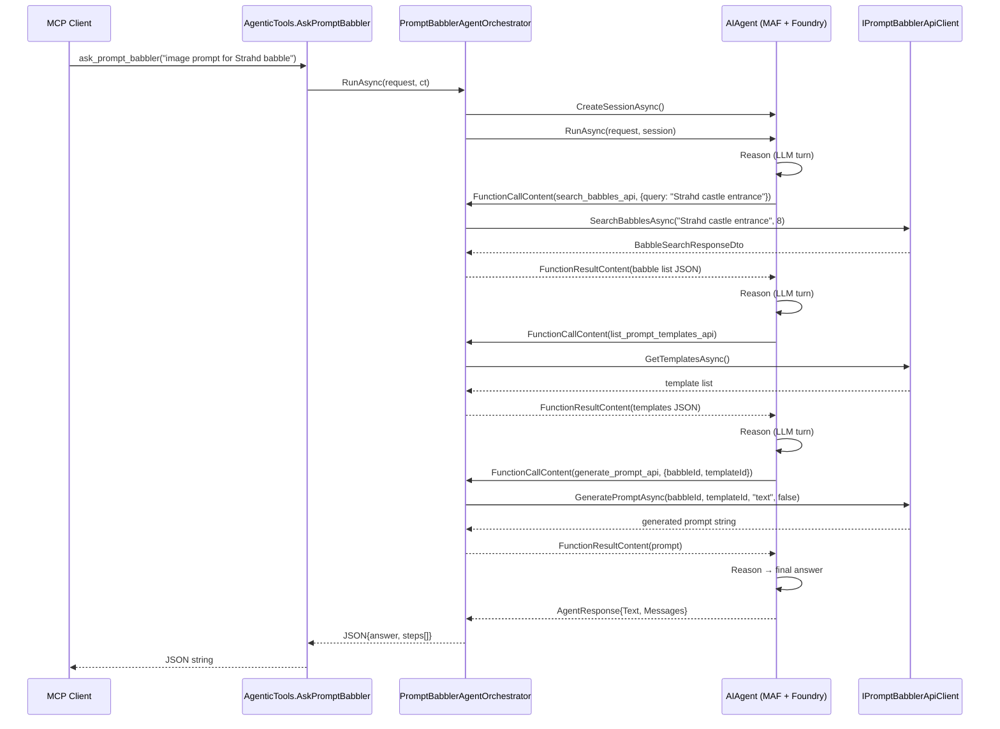

<!-- markdownlint-disable-file -->
# Task Research: `ask_prompt_babbler` Agentic MCP Tool (Microsoft Agent Framework)

Add a new agentic MCP tool (`ask_prompt_babbler`) to the existing Prompt Babbler MCP server. The tool accepts natural-language instructions, runs a ReAct-style (Reason → Act → Observe) loop using Microsoft Agent Framework, orchestrates multiple backend API calls via `IPromptBabblerApiClient`, and returns a result with an execution trace.

## Task Implementation Requests

* Add a new `ask_prompt_babbler` MCP tool to `prompt-babbler-service/src/McpServer/`.
* Back the tool with Microsoft Agent Framework (MAF), using an LLM deployed on Microsoft Foundry.
* Expose existing backend operations (search babbles, get babble, list/get templates, generate prompt, list generated prompts) as MAF function tools so the agent can orchestrate multi-step requests.
* Integrate with the existing `IPromptBabblerApiClient` abstraction and the ASP.NET Core DI system.
* Add required NuGet packages using Central Package Management (`Directory.Packages.props`).
* Wire the Foundry project endpoint via configuration (compatible with existing Aspire resource naming).
* Document the chosen approach and implementation details.

## Scope and Success Criteria

* Scope: McpServer project only; no changes to Api, Domain, or Infrastructure projects.
* Assumptions:
  * The `ai-foundry` Aspire connection string / `AZURE_AI_PROJECT_ENDPOINT` env var is available to the MCP server process.
  * The `chat` model deployment name is already provisioned in the Foundry project.
  * `IPromptBabblerApiClient` is sufficient as the action surface; no direct Cosmos DB or Speech calls required from the agent.
* Success Criteria:
  * `ask_prompt_babbler` registered as an MCP tool, visible via `WithToolsFromAssembly()`.
  * Agent loop powered by `Microsoft.Agents.AI` and `Microsoft.Agents.AI.Foundry`.
  * Function tools map one-to-one to existing `IPromptBabblerApiClient` methods.
  * Agent endpoint resolved from config key `Agentic:FoundryProjectEndpoint` or env var fallback.
  * DI registration is transient/scoped so each MCP request gets a fresh session.
  * All tool classes remain `sealed` per project conventions.
  * Build passes `dotnet format --verify-no-changes`.

## Outline

1. NuGet packages (MAF) — versions to pin
2. Configuration keys and Aspire wiring
3. `PromptBabblerAgentOrchestrator` service — tool registration and run loop
4. `AgenticTools` MCP tool class
5. DI registration in `Program.cs`
6. AppHost wiring — how to pass Foundry endpoint to MCP server
7. Unit test scaffolding
8. Alternatives evaluated

## Potential Next Research

* None — all original pending items resolved by follow-on research (2026-05-09).

## Research Executed

### File Analysis


* prompt-babbler-service/src/McpServer/Program.cs (follow-on)
  * Confirmed: no `TokenCredential`, no `AIProjectClient`, no AI config today.
  * `GetConnectionString("ai-foundry")` is NOT called — endpoint must be added via AppHost `.WithReference(foundryProject)`.

* prompt-babbler-service/src/McpServer/Program.cs
  * Lines 1-88: MCP server bootstrap; `.WithToolsFromAssembly()` auto-discovers `[McpServerToolType]` classes. DI available for constructor injection.
  * Line 70: `IPromptBabblerApiClient` registered as `AddHttpClient<>` scoped-to-request via `PromptBabblerApiClient`.
  * Lines 12-26: No Azure AI / Foundry clients registered here at all.

* prompt-babbler-service/src/McpServer/Tools/BabbleTools.cs
  * Lines 8-54: Tool class is `sealed`, uses constructor injection of `IPromptBabblerApiClient`, `[McpServerToolType]`, `[McpServerTool]` attributes. Pattern to replicate for `AgenticTools`.

* prompt-babbler-service/src/McpServer/Client/IPromptBabblerApiClient.cs
  * Lines 1-26: Full action surface for the agent: SearchBabbles, ListBabbles, GetBabble, GetTemplates, GetTemplate, GeneratePrompt, ListGeneratedPrompts.

* prompt-babbler-service/src/McpServer/PromptBabbler.McpServer.csproj
  * No Azure.Identity, Azure.AI.Projects, or Microsoft.Agents.AI references — all must be added.

* prompt-babbler-service/src/Orchestration/AppHost/AppHost.cs
  * Lines 1-106: Aspire wiring; `foundryProject` is referenced by `apiService` but NOT by `mcpServer`. The MCP server is only given the `apiService` reference and some Entra env vars. **Foundry endpoint not currently passed to MCP server.**

* prompt-babbler-service/src/Api/Program.cs
  * Lines 92-130: Connection string parse logic for `ai-foundry` → strips `/api/projects/{name}` to get account endpoint for `AzureOpenAIClient`. `AIProjectClient` needs the full project endpoint (`Endpoint=https://...services.ai.azure.com/api/projects/{name}`).
  * Lines 74-83: Credential strategy: `DefaultAzureCredential` in dev, `ManagedIdentityCredential` in production.

* prompt-babbler-service/Directory.Packages.props
  * Azure.Identity 1.21.0 already pinned. `Azure.AI.Projects` and `Microsoft.Agents.AI*` not present — need to add.

* prompt-babbler-service/Directory.Build.props
  * TargetFramework: net10.0, Nullable: enable, TreatWarningsAsErrors: true, ImplicitUsings: enable.

### Code Search Results

* `AIProjectClient` — not used anywhere in the solution yet.
* `AsAIAgent` — not used anywhere in the solution yet.
* `Microsoft.Agents.AI` — not referenced in any `.csproj`.
* `[McpServerToolType]` — found in BabbleTools.cs, PromptTemplateTools.cs, GeneratedPromptTools.cs. All follow identical pattern.
* `GetConnectionString("ai-foundry")` — found only in Api/Program.cs line 92. MCP server does not read it today.
* `ManagedIdentityCredential` — used in Api/Program.cs for production; pattern to replicate in MCP server orchestrator.

### External Research

* MAF README: `dotnet add package Microsoft.Agents.AI` + `dotnet add package Microsoft.Agents.AI.Foundry` + `dotnet add package Azure.AI.Projects` + `dotnet add package Azure.Identity`
  * Source: https://github.com/microsoft/agent-framework
* MAF Foundry sample (Agent_Step03_UsingFunctionTools):
  * `AIFunctionFactory.Create(method)` produces `AITool` from an annotated static or instance method.
  * `aiProjectClient.AsAIAgent(model, instructions, name, tools)` creates a `FoundryAgent` / `AIAgent`.
  * `await agent.CreateSessionAsync()` → `AgentSession`.
  * `await agent.RunAsync(prompt, session)` → `AgentResponse` with `.Text` and `.Messages`.
  * `response.Messages.SelectMany(m => m.Contents)` exposes `FunctionCallContent` (Act) and `FunctionResultContent` (Observe) alongside `TextContent` (Reason/Answer).
* MAF MCP sample (Agent_Step09_UsingMcpClientAsTools):
  * `McpClient.CreateAsync(new HttpClientTransport(...))` → `IList<McpClientTool>` castable to `AITool`.
  * Pattern: the MAF agent treats MCP tools as function tools.
* MAF Agent-as-FunctionTool (Agent_Step11_AsFunctionTool):
  * `weatherAgent.AsAIFunction()` wraps an agent as a callable tool for another agent.
  * Useful for future multi-agent composition.
* NuGet versions (confirmed 2026-05-09):
  * `Microsoft.Agents.AI` **1.5.0** — released 2026-05-08; matches `dotnet-1.5.0` GitHub release tag
  * `Microsoft.Agents.AI.Foundry` **1.5.0** — released 2026-05-08; same release train
  * `Azure.AI.Projects` **2.0.1** — released 2026-04-24; latest stable GA
  * Sources: https://www.nuget.org/packages/Microsoft.Agents.AI, https://www.nuget.org/packages/Microsoft.Agents.AI.Foundry, https://www.nuget.org/packages/Azure.AI.Projects

* Aspire `.WithReference(foundryProject)` env var injection (confirmed 2026-05-09):
  * Injects `ConnectionStrings__ai-foundry` = `Endpoint=https://account.services.ai.azure.com/api/projects/name`
  * Same var read by `builder.Configuration.GetConnectionString("ai-foundry")` — identical parse path as Api/Program.cs
  * Source: Aspire.Hosting.Foundry README; Api/Program.cs usage pattern

* `AIProjectClient` connection string format (confirmed 2026-05-09):
  * `AIProjectClient` takes a bare `Uri` (project-level endpoint)
  * Unlike `AzureOpenAIClient`, does **not** need account-level stripping of `/api/projects/{name}`
  * The `Endpoint=` prefix from the Aspire connection string must be stripped, but the path is used as-is
  * Parsing code: identical strip of `Endpoint=` prefix; no further path manipulation

* CancellationToken propagation in MAF (confirmed 2026-05-09):
  * Fully propagated: `RunAsync(ct)` → `FunctionInvokingChatClient.ProcessFunctionCallsAsync(ct)` → `context.Function.InvokeAsync(arguments, ct)`
  * `AIFunctionFactory.Create` reflects delegate parameters; if delegate declares `CancellationToken ct`, it receives the propagated token automatically
  * Source: MAF source on GitHub (`FunctionInvokingChatClient`)

* `AddSingleton` safety for orchestrator (confirmed 2026-05-09):
  * **Safe.** MAF `AspNetAgentAuthorization` sample explicitly uses `AddSingleton<AIAgent>`
  * Thread-safety guaranteed by: per-run `AgentSession` isolation; `AsyncLocal<AgentRunContext>` for ambient context; `FunctionInvokingChatClient` documented thread-safe when tools are stateless
  * `IPromptBabblerApiClient` is already registered as a scoped/transient HTTP client — orchestrator must capture it at construction or accept it per-call. Since orchestrator is Singleton and `IPromptBabblerApiClient` is registered via `AddHttpClient` (transient), the client must be injected via `IHttpClientFactory` or a factory delegate, not directly. **Revised pattern: inject `IHttpClientFactory` or use a factory-injected client.**
  * Alternative: register orchestrator as `AddScoped` — simpler, avoids Captive Dependency issue

* Testability pattern (confirmed 2026-05-09):
  * `AIAgent` is abstract (not sealed); no `IAIAgent` interface exists
  * `ChatClientAgent` is sealed — cannot be subclassed
  * **Recommended pattern: extract `IPromptBabblerAgentOrchestrator` interface** — unit tests mock the interface with NSubstitute; integration tests use a fake `IChatClient` injected into `ChatClientAgent`
  * `IChatClient` is a proper interface; `IChatClient` stub returning controlled `ChatResponse` is the most idiomatic MAF test approach
  * Source: MAF community guidance; MAF source analysis

### Project Conventions

* Standards referenced: AGENTS.md, .github/copilot-instructions.md
  * All classes `sealed` unless designed for inheritance.
  * Domain models are immutable `sealed record` types.
  * Private fields: `_camelCase`.
  * Interfaces in Domain/Interfaces; but for McpServer the orchestrator is an infrastructure service, no interface needed (single consumer).
  * Constructor injection only.
  * `[TestCategory("Unit")]` on every test class.
* Instructions followed: copilot-instructions.md § ASP.NET Core Patterns.

## Key Discoveries

### Project Structure

* MCP server has no AI/Foundry wiring today — all AI is in the Api project.
* AppHost does not pass `foundryProject` reference to MCP server — requires a code change in AppHost.cs.
* The `ai-foundry` connection string format in Aspire provides a full project endpoint (including `/api/projects/{name}`), which is exactly what `AIProjectClient` needs (unlike `AzureOpenAIClient` which needs account-level).
* `IPromptBabblerApiClient` already has all actions needed for a useful ReAct loop without any changes to the Api project.
* **Captive Dependency**: registering orchestrator as Singleton while `IPromptBabblerApiClient` is transient (from `AddHttpClient`) is a captive dependency. Resolution: register orchestrator as `AddScoped` to match the HTTP client lifetime, **or** inject `IHttpClientFactory` and resolve client per call. Scoped is simpler and aligns with per-request MCP tool invocation semantics.
* **Interface extraction required for testability**: `IPromptBabblerAgentOrchestrator` interface lets `AgenticTools` be unit-tested independently of MAF.

### Implementation Patterns

* `AIFunctionFactory.Create(instanceMethod)` works with instance methods when you pass the bound delegate.
* For DI-friendly tool registration, wrap the `IPromptBabblerApiClient` calls in private methods of the orchestrator class; `AIFunctionFactory.Create` closes over `this`.
* The MCP tool class (`AgenticTools`) injects the orchestrator interface and calls `orchestrator.RunAsync(request, cancellationToken)`.
* MAF `RunAsync` internally manages the full Reason → Act → Observe loop; you never write the loop manually.
* The `AgentSession` persists conversation history for multi-turn; for single-turn MCP tool use, create a new session per call.
* Declare private async tool methods with `CancellationToken cancellationToken = default` — MAF will inject the propagated token automatically.
* Register orchestrator as `AddScoped` to avoid captive dependency with the transient `IPromptBabblerApiClient`.

### Complete Examples

```csharp
// -- Program.cs (McpServer) --
// Parse foundry project endpoint from Aspire connection string
var aiFoundryConnStr = builder.Configuration.GetConnectionString("ai-foundry") ?? "";
var projectEndpoint = "";
foreach (var part in aiFoundryConnStr.Split(';', StringSplitOptions.RemoveEmptyEntries))
{
  var trimmed = part.Trim();
  if (trimmed.StartsWith("Endpoint=", StringComparison.OrdinalIgnoreCase))
  {
    projectEndpoint = trimmed["Endpoint=".Length..].TrimEnd('/');
    break;
  }
}
// Fall back to treating whole string as URI
if (string.IsNullOrEmpty(projectEndpoint) &&
  aiFoundryConnStr.StartsWith("https://", StringComparison.OrdinalIgnoreCase))
{
  projectEndpoint = aiFoundryConnStr.Split(';')[0].TrimEnd('/');
}

// Credential: DefaultAzureCredential in dev, ManagedIdentityCredential in production (matches Api project)
TokenCredential agentCredential = builder.Environment.IsDevelopment()
  ? new DefaultAzureCredential()
  : new ManagedIdentityCredential(ManagedIdentityId.SystemAssigned);

if (!string.IsNullOrEmpty(projectEndpoint))
{
  var aiProjectClient = new AIProjectClient(new Uri(projectEndpoint), agentCredential);
  builder.Services.AddSingleton(aiProjectClient);
}

builder.Services.AddScoped<IPromptBabblerAgentOrchestrator, PromptBabblerAgentOrchestrator>();

// -- PromptBabblerAgentOrchestrator.cs --
public sealed class PromptBabblerAgentOrchestrator(
  IPromptBabblerApiClient apiClient,
  AIProjectClient projectClient,
  IConfiguration configuration) : IPromptBabblerAgentOrchestrator
{
  private static readonly JsonSerializerOptions JsonOptions = new(JsonSerializerDefaults.Web);
  private readonly string _model = configuration["Agentic:ModelDeploymentName"] ?? "chat";

  public async Task<string> RunAsync(string request, CancellationToken cancellationToken)
  {
    AIAgent agent = projectClient.AsAIAgent(
      model: _model,
      name: "PromptBabblerAgent",
      instructions: AgentInstructions,
      tools: BuildTools());

    AgentSession session = await agent.CreateSessionAsync(cancellationToken);
    AgentResponse response = await agent.RunAsync(request, session, cancellationToken: cancellationToken);

    var steps = response.Messages
      .SelectMany(m => m.Contents)
      .Select<AIContent, AgentStep?>(content => content switch
      {
        FunctionCallContent call => new("act", call.Name ?? "unknown", JsonSerializer.Serialize(call.Arguments, JsonOptions)),
        FunctionResultContent result => new("observe", result.CallId ?? "unknown", result.Result?.ToString() ?? ""),
        TextContent text when !string.IsNullOrWhiteSpace(text.Text) => new("reason", "text", text.Text),
        _ => null
      })
      .OfType<AgentStep>()
      .ToList();

    return JsonSerializer.Serialize(new AgentRunResult(response.Text ?? string.Empty, steps), JsonOptions);
  }

  private IReadOnlyList<AITool> BuildTools() =>
  [
    AIFunctionFactory.Create(SearchBabblesAsync, name: "search_babbles_api"),
    AIFunctionFactory.Create(GetBabbleAsync, name: "get_babble_api"),
    AIFunctionFactory.Create(ListPromptTemplatesAsync, name: "list_prompt_templates_api"),
    AIFunctionFactory.Create(GetPromptTemplateAsync, name: "get_prompt_template_api"),
    AIFunctionFactory.Create(GeneratePromptAsync, name: "generate_prompt_api"),
    AIFunctionFactory.Create(ListGeneratedPromptsAsync, name: "list_generated_prompts_api")
  ];

  // Each tool method receives propagated CancellationToken automatically via AIFunctionFactory reflection
  [Description("Search babbles by semantic relevance.")]
  private async Task<string> SearchBabblesAsync(
    [Description("Natural language query")] string query,
    [Description("Top matches (1-50)")] int topK = 8,
    CancellationToken cancellationToken = default)
  {
    var result = await apiClient.SearchBabblesAsync(query, topK, cancellationToken);
    return JsonSerializer.Serialize(result, JsonOptions);
  }
  // ... (pattern repeated for remaining tools)

  private const string AgentInstructions = """
    You are the Prompt Babbler task agent. Use tools to gather facts before answering.
    Order of operations:
    1. search_babbles_api — find the babble ID from user intent
    2. list_prompt_templates_api / get_prompt_template_api — pick an appropriate template
    3. generate_prompt_api — generate the final prompt
    Return concise results and include IDs used. Never invent IDs or template names.
    """;

  public sealed record AgentStep(string Type, string Name, string Data);
  public sealed record AgentRunResult(string Answer, IReadOnlyList<AgentStep> Steps);
}

// -- IPromptBabblerAgentOrchestrator.cs --
public interface IPromptBabblerAgentOrchestrator
{
  Task<string> RunAsync(string request, CancellationToken cancellationToken);
}

// -- AgenticTools.cs --
[McpServerToolType]
public sealed class AgenticTools(IPromptBabblerAgentOrchestrator orchestrator)
{
  [McpServerTool(Name = "ask_prompt_babbler")]
  [Description("Agentic tool that plans and executes multiple Prompt Babbler API actions using a ReAct loop.")]
  public Task<string> AskPromptBabbler(
    [Description("Natural language instruction, e.g. give me the image generation prompt for my Strahd castle entrance babble.")] string request,
    CancellationToken cancellationToken = default)
    => orchestrator.RunAsync(request, cancellationToken);
}
```

### API and Schema Documentation

* `AIAgent.RunAsync(string message, AgentSession? session, AgentRunOptions? options, CancellationToken ct)` → `AgentResponse`
* `AgentResponse.Text` — final text answer
* `AgentResponse.Messages` — `IReadOnlyList<ChatMessage>` with `Contents: IList<AIContent>`
* `AIContent` subtypes visible in messages: `TextContent`, `FunctionCallContent`, `FunctionResultContent`
* `AIFunctionFactory.Create(Delegate method, string? name, string? description)` → `AIFunction : AITool`
* `AIProjectClient(Uri projectEndpoint, TokenCredential)` — project endpoint format: `https://{account}.services.ai.azure.com/api/projects/{project-name}`
* `AIProjectClient.AsAIAgent(string model, string? instructions, string? name, IEnumerable<AITool>? tools)` → `AIAgent`

### Configuration Examples

```json
// appsettings.json / user-secrets (McpServer) — only needed for non-Aspire local dev
{
  "Agentic": {
    "ModelDeploymentName": "chat"
  },
  "ConnectionStrings": {
    "ai-foundry": "Endpoint=https://your-account.services.ai.azure.com/api/projects/your-project"
  }
}
```

```csharp
// AppHost.cs — add foundryProject reference to mcpServer (REQUIRED)
var mcpServer = builder.AddProject<Projects.PromptBabbler_McpServer>("mcp-server")
    .WithExternalHttpEndpoints()
    .WithReference(apiService)
    .WithReference(foundryProject)   // ADD: injects ConnectionStrings__ai-foundry
    .WaitFor(apiService)
    .WaitFor(foundryProject)         // ADD: wait for Foundry to be ready
    // ...existing env vars...
```

```xml
<!-- Directory.Packages.props additions -->
<PackageVersion Include="Microsoft.Agents.AI" Version="1.5.0" />
<PackageVersion Include="Microsoft.Agents.AI.Foundry" Version="1.5.0" />
<PackageVersion Include="Azure.AI.Projects" Version="2.0.1" />
```

```xml
<!-- PromptBabbler.McpServer.csproj additions -->
<PackageReference Include="Microsoft.Agents.AI" />
<PackageReference Include="Microsoft.Agents.AI.Foundry" />
<PackageReference Include="Azure.AI.Projects" />
<PackageReference Include="Azure.Identity" />
```

## Technical Scenarios

### Scenario A: MAF with Foundry-hosted agent (AIProjectClient.AsAIAgent)

Full Foundry Agents Service integration — agent state, thread management, and model routing handled by Foundry.

**Requirements:**

* `Azure.AI.Projects` NuGet (Foundry SDK)
* `Microsoft.Agents.AI` + `Microsoft.Agents.AI.Foundry` NuGet
* Foundry project endpoint in config
* `ai-foundry` connection string passed from Aspire AppHost to MCP server

**Preferred Approach:** ✅ Selected

Using `AIProjectClient.AsAIAgent(...)` backed by Microsoft Foundry. The `AIProjectClient` is registered as a Singleton; `PromptBabblerAgentOrchestrator` is registered as `AddScoped` to match the `IPromptBabblerApiClient` transient HTTP client lifetime and avoid a captive dependency. The `AIAgent` is created per-request call inside `RunAsync` (light-weight — it is a configuration object, not a persistent thread); `CreateSessionAsync()` creates the Foundry thread for that call.

```text
McpServer/
  Agents/
    PromptBabblerAgentOrchestrator.cs   (new)
  Tools/
    AgenticTools.cs                     (new)
  PromptBabbler.McpServer.csproj        (add MAF + Azure.AI.Projects refs)
  Program.cs                            (register orchestrator as singleton)
Orchestration/
  AppHost/
    AppHost.cs                          (add .WithReference(foundryProject) to mcpServer)
```



**Implementation Details:**

**Lifetime**: `AIProjectClient` → Singleton. `PromptBabblerAgentOrchestrator` → Scoped. `AIAgent` created per `RunAsync` call (object creation is cheap; Foundry creates a new persistent agent thread resource per `CreateSessionAsync`).

**CancellationToken**: pass `cancellationToken` to `CreateSessionAsync` and `RunAsync`. MAF propagates it through the full function-calling loop into each tool invocation delegate automatically (confirmed from source analysis of `FunctionInvokingChatClient`). Declare private async tool methods with `CancellationToken cancellationToken = default` to receive it.

**Credential**: match the Api project pattern — `DefaultAzureCredential` in development (`IsDevelopment()`), `ManagedIdentityCredential(ManagedIdentityId.SystemAssigned)` in production. `Azure.Identity` is already pinned in `Directory.Packages.props` at version 1.21.0.

**Captive Dependency resolved**: orchestrator is `AddScoped` → both orchestrator and `IPromptBabblerApiClient` (transient via `AddHttpClient`) resolve fresh per request. No lifetime mismatch.

**Testability**: extract `IPromptBabblerAgentOrchestrator` interface. `AgenticTools` depends on the interface — unit tests use `NSubstitute.For<IPromptBabblerAgentOrchestrator>()`. Orchestrator integration tests inject a fake `IChatClient` to control the agent's LLM responses without a live Foundry connection.

**AppHost change required**: add `.WithReference(foundryProject).WaitFor(foundryProject)` to the `mcpServer` builder — this is the only change outside the McpServer project.

#### Considered Alternatives

**Scenario B: MAF with AzureOpenAIClient (non-Foundry agent)**

Use `AzureOpenAIClient.GetChatClient().AsIChatClient().AsAIAgent(...)` — this uses the standard chat completions API and manages tool-calling loop locally in MAF without Foundry Agents Service.

* Advantage: Simpler — no agent thread management in Foundry, no `Azure.AI.Projects` dependency.
* Disadvantage: Does not leverage Foundry Agents Service (no persistent thread, no Foundry UI tracing). Requires account-level endpoint, not project endpoint — needs the same parse logic as the Api project today.
* Rejected: Issue #141 explicitly requires Foundry; `AIProjectClient.AsAIAgent` is the idiomatic MAF path for Foundry-hosted apps.

**Scenario C: Manual ReAct loop (no MAF)**

Implement a custom Reason → Act → Observe loop using the existing `IChatClient` registered in the Api project.

* Advantage: No new packages; re-uses existing `IChatClient`.
* Disadvantage: Loop logic must be built from scratch, including tool dispatch, error handling, stop conditions, and token budget management. High engineering cost, fragile.
* Rejected: Issue #141 explicitly requires Microsoft Agent Framework.

**Scenario D: MCP client tools (Agent_Step09 pattern)**

Use `McpClient.CreateAsync` to connect back to the same MCP server and pass its tools to the MAF agent, rather than wrapping `IPromptBabblerApiClient` directly.

* Advantage: Exact MCP tool parity; no separate function tool registration.
* Disadvantage: Creates a self-referential HTTP connection (MCP server calling itself). Latency overhead. Creates a dependency loop if the MCP server endpoint is not stable (especially in development). Harder to test.
* Rejected: Wrapping `IPromptBabblerApiClient` directly is lower latency, simpler, and fully testable with NSubstitute.

---

## Pending Research

All pending items resolved. No outstanding research gaps.

## Implementation Checklist

Files to create:

* `prompt-babbler-service/src/McpServer/Agents/IPromptBabblerAgentOrchestrator.cs`
* `prompt-babbler-service/src/McpServer/Agents/PromptBabblerAgentOrchestrator.cs`
* `prompt-babbler-service/src/McpServer/Tools/AgenticTools.cs`

Files to modify:

* `prompt-babbler-service/Directory.Packages.props` — add `Microsoft.Agents.AI 1.5.0`, `Microsoft.Agents.AI.Foundry 1.5.0`, `Azure.AI.Projects 2.0.1`
* `prompt-babbler-service/src/McpServer/PromptBabbler.McpServer.csproj` — add four `<PackageReference>` elements
* `prompt-babbler-service/src/McpServer/Program.cs` — parse `ai-foundry` connection string, register `AIProjectClient` as singleton, register orchestrator as scoped; add `using` for `Azure.Identity`, `Azure.AI.Projects`, `Azure.Core`
* `prompt-babbler-service/src/Orchestration/AppHost/AppHost.cs` — add `.WithReference(foundryProject).WaitFor(foundryProject)` to `mcpServer`
* `docs/MCP-SERVER.md` — add `ask_prompt_babbler` entry to Tools table and a new Agentic Tools section

Tests to create:

* `prompt-babbler-service/tests/unit/McpServer.UnitTests/Tools/AgenticToolsTests.cs`
* `prompt-babbler-service/tests/unit/McpServer.UnitTests/Agents/PromptBabblerAgentOrchestratorTests.cs` (uses fake `IChatClient`)
