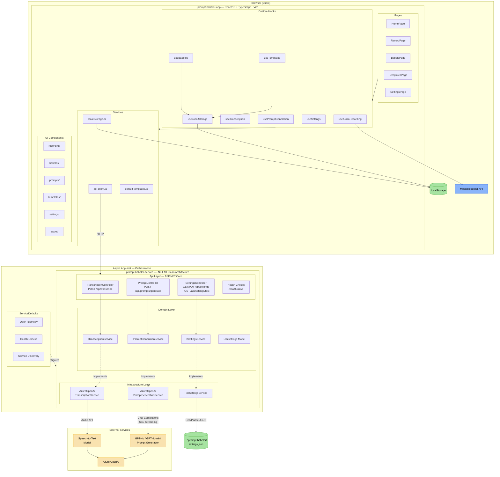
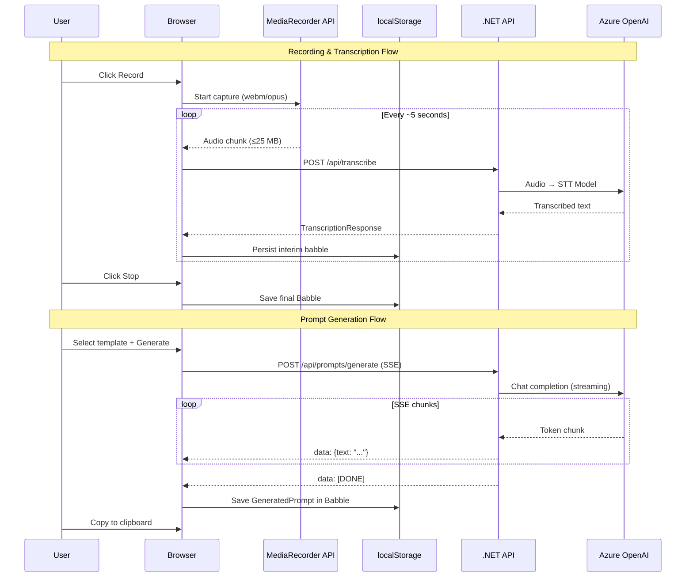
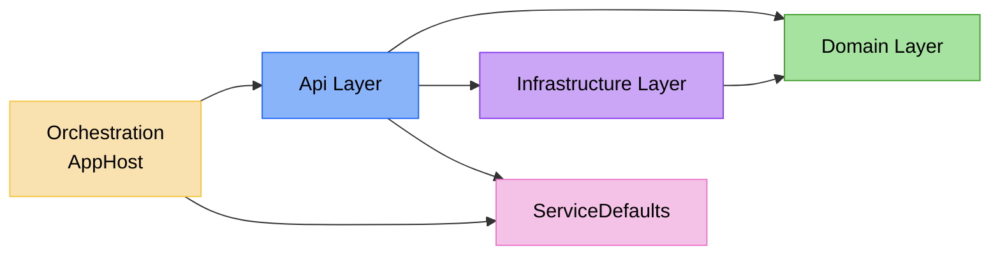

# Logical Architecture: Prompt Babbler

**Date**: 2026-02-13 | **Plan**: [plan.md](plan.md)

## Component Diagram

## Data Flow Diagram

## Layer Dependency Rules

- **Domain** has zero external dependencies (pure business models + interfaces)
- **Infrastructure** implements Domain interfaces, depends on external SDKs
- **Api** depends on Domain (contracts) and registers Infrastructure (DI)
- **Orchestration** wires everything together via Aspire AppHost
